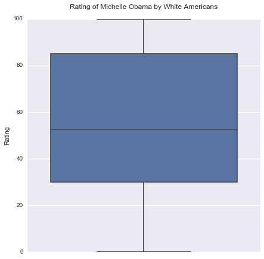

# Data
Americans where surveyed on political views and general outlook. Among the questions, they were asked the following.
* African/African American/Black: I have concerns about having bi-racial/ethnic children (W1_E61_C)
  * -1 Refused, 1  Agree Strongly, 2  Agree Somewhat, 3  Disagree Somewhat, 4  Disagree Strongly
* [Michelle Obama] How would you rate (W1_D3)
  * 0 to 100
* Race / Ethnicity (PPETHM)
  * 1 White, Non-Hispanic, 2 Black, Non-Hispanic, 3 Other, Non-Hispanic, 4 Hispanic, 5 2+ Races, Non-Hispanic

I've limited the data to responses from white Americans to examine their views on race.

# Univariate Visuals




# Two Categories -> Quantitative

I created a column IN_EX_CLUSIVE from the values in W1_E61_C, "I have concerns about having bi-racial/ethnic children". The inclusive category includes Somewhat Disagree and Strongly Disagree while the exclusive category includes Somewhat Agree and Somewhat Agree.


With a p-score less that 0.001, there is a signficant difference between the rating of Michelle Obama among white American's that are concerned vs not concerned about biracial children.

*See program output for the full ols summary.*

# Multiple Categories -> Quantitative
Comparing ratings of Michelle Obama across all four categories of "I have concerns about having bi-racial/ethnic children".


#### There is a significan difference between 5 out of 6 group pairs.

Output from Multiple Comparison of Means - Tukey HSD,FWER=0.05

group1      |       group2      | meandiff |  lower   |  upper  | reject
---|---|---|---|---|---
Agree Somewhat  |   Agree Strongly  | -10.7778 | -19.8562 | -1.6994 |  True
Agree Somewhat  | Disagree Somewhat |  6.496   | -1.9504  | 14.9424 | False
Agree Somewhat  | Disagree Strongly |  14.862  |  7.042   |  22.682 |  True
Agree Strongly  | Disagree Somewhat | 17.2738  |  7.9492  | 26.5983 |  True
Agree Strongly  | Disagree Strongly | 25.6398  | 16.8787  | 34.4009 |  True
Disagree Somewhat | Disagree Strongly |  8.366   |  0.2616  | 16.4704 |  True

# Program Output
```
Outlook on Life Surveys, 2012
Count of rows 2294
Count of columns 436
Limiting to 814 responses from white Americans
Define IN_EX_CLUSIVE (inclusive vs exclusive) by views on mixed race children.
```


```
                            OLS Regression Results
==============================================================================
Dep. Variable:                  W1_D3   R-squared:                       0.056
Model:                            OLS   Adj. R-squared:                  0.055
Method:                 Least Squares   F-statistic:                     44.66
Date:                Fri, 23 Sep 2016   Prob (F-statistic):           4.56e-11
Time:                        07:13:52   Log-Likelihood:                -3699.7
No. Observations:                 757   AIC:                             7403.
Df Residuals:                     755   BIC:                             7413.
Df Model:                           1                                         
Covariance Type:            nonrobust                                         
=================================================================================================
                                    coef    std err          t      P>|t|      [95.0% Conf. Int.]
-------------------------------------------------------------------------------------------------
Intercept                        44.3728      1.747     25.393      0.000        40.942    47.803
C(IN_EX_CLUSIVE)[T.inclusive]    15.6964      2.349      6.683      0.000        11.085    20.307
==============================================================================
Omnibus:                      183.545   Durbin-Watson:                   1.966
Prob(Omnibus):                  0.000   Jarque-Bera (JB):               41.204
Skew:                          -0.258   Prob(JB):                     1.13e-09
Kurtosis:                       1.980   Cond. No.                         2.76
==============================================================================

Warnings:
[1] Standard Errors assume that the covariance matrix of the errors is correctly specified.
```


```
         Multiple Comparison of Means - Tukey HSD,FWER=0.05         
====================================================================
      group1            group2      meandiff  lower    upper  reject
--------------------------------------------------------------------
  Agree Somewhat    Agree Strongly  -10.7778 -19.8562 -1.6994  True 
  Agree Somewhat  Disagree Somewhat  6.496   -1.9504  14.9424 False 
  Agree Somewhat  Disagree Strongly  14.862   7.042    22.682  True 
  Agree Strongly  Disagree Somewhat 17.2738   7.9492  26.5983  True 
  Agree Strongly  Disagree Strongly 25.6398  16.8787  34.4009  True 
Disagree Somewhat Disagree Strongly  8.366    0.2616  16.4704  True 
--------------------------------------------------------------------
```

# Program
```
import numpy
import pandas
import seaborn
import matplotlib.pyplot as plt
import statsmodels.formula.api as smf
import statsmodels.stats.multicomp as multi

ool = pandas.read_csv('../data/ool_pds.csv', low_memory=False)

print('Outlook on Life Surveys, 2012')
print('Count of rows %d' % len(ool))
print('Count of columns %d' % len(ool.columns))

ETHNICITY = 'PPETHM'
ETHNICITY_Q = """Race / Ethnicity
1 White, Non-Hispanic
2 Black, Non-Hispanic
3 Other, Non-Hispanic
4 Hispanic
5 2+ Races, Non-Hispanic"""

CHILD_BLACK = 'W1_E61_C'
CHILD_BLACK_Q =  """I have concerns about having bi-racial/ethnic children [African/African American/Black]
How do you rate each of the following groups
on these characteristics?
-1 Refused
1  Agree Strongly
2  Agree Somewhat
3  Disagree Somewhat
4  Disagree Strongly"""

RATE_MICHELLE = 'W1_D3'
RATE_MICHELLE_Q = '[Michelle Obama] How would you rate'

def prepareNumeric(data, attr):
    data[attr] = pandas.to_numeric(data[attr], errors='coerce')
    data[attr] = data[attr].replace(-1, numpy.nan)

prepareNumeric(ool, CHILD_BLACK)
prepareNumeric(ool, RATE_MICHELLE)
ool[RATE_MICHELLE] = ool[RATE_MICHELLE].replace(998, numpy.nan)

whites = ool[(ool[ETHNICITY] == 1)].copy()
print('Limiting to %d responses from white Americans' % len(whites))

print('Define IN_EX_CLUSIVE (inclusive vs exclusive) by views on mixed race children.')
def inclusive_or_exclusive(row):
    if row[CHILD_BLACK] == 1 or row[CHILD_BLACK] == 2:
        return 'exclusive'
    elif row[CHILD_BLACK] == 3 or row[CHILD_BLACK] == 4:
        return 'inclusive'
    else:
        numpy.nan
whites['IN_EX_CLUSIVE'] = whites.apply(inclusive_or_exclusive, axis=1)

def print_divider():
    print('\n\n' + '-'*75)

def summarize(data, attr, desc):
    counts = data.groupby(attr, sort=False).size()
    relative = counts * 100 / len(data)
    print_divider()
    print(desc)
    print('Response counts:')
    print(counts)
    print('Response percentages:')
    print(relative)

def crosstab_summarize(data, attr1, attr2, title):
    print_divider()
    print('%s (crosstab %s * %s).' % (title, attr1, attr2))
    crosstab = pandas.crosstab(data[attr1], data[attr2])
    relative_crosstab = crosstab.apply(lambda r: 100*r/r.sum(), axis=1)
    print('Counts')
    print(crosstab)
    print('Percentages')
    print(relative_crosstab)

def as_category(data, attr, names):
  data[attr] = data[attr].astype('category')
  data[attr] = data[attr].cat.rename_categories(names)

# Figure sizes in inches. For some reason this does not apply to the factorplot.
seaborn.mpl.rc("figure", figsize=(7,7))

as_category(whites, CHILD_BLACK, ["Agree Strongly", "Agree Somewhat", "Disagree Somewhat", "Disagree Strongly"])
seaborn.countplot(x=CHILD_BLACK, data=whites)
plt.title('I have concerns about having bi-racial/ethnic children (African/African American/Black)\n')
plt.xlabel('')
plt.ylabel('# White Americans')
plt.show()

seaborn.boxplot(y=RATE_MICHELLE, data=whites);
plt.ylabel('Rating')
plt.title('Rating of Michelle Obama by White Americans\n')
plt.show()

seaborn.boxplot(x='IN_EX_CLUSIVE', y=RATE_MICHELLE, data=whites);
plt.ylabel('Rating')
plt.title('Rating of Michelle Obama by White Americans\n')
plt.show()

model1 = smf.ols(formula='%s ~ C(%s)' % (RATE_MICHELLE, 'IN_EX_CLUSIVE'), data=whites)
results1 = model1.fit()
print(results1.summary())

seaborn.factorplot(x=CHILD_BLACK, y=RATE_MICHELLE, data=whites, kind='bar', ci=None, size=8)
plt.xlabel('I have concerns about having bi-racial/ethnic children (African/African American/Black)')
plt.ylabel('Rating of Michelle Obama')
plt.title('White American\'s Rating of Michell Obama and Concerns of Biracial Children')
plt.show()

seaborn.boxplot(x=CHILD_BLACK, y=RATE_MICHELLE, data=whites);
plt.xlabel('I have concerns about having bi-racial/ethnic children (African/African American/Black)')
plt.ylabel('Rating')
plt.title('Rating of Michelle Obama by White Americans\n')
plt.show()

whites = whites[[RATE_MICHELLE, CHILD_BLACK]].dropna()
mc1 = multi.MultiComparison(whites[RATE_MICHELLE], whites[CHILD_BLACK])
res1 = mc1.tukeyhsd()
print(res1.summary())
```
