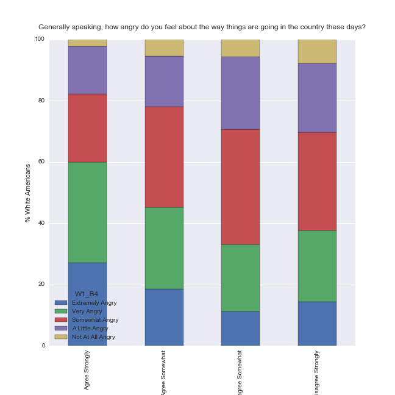

# Interpretation for Chi-Square Tests:

The script below examines the association between
* (categorical explanatory) Opinions of white Americans on having children with a black partner
  * I have concerns about having bi-racial/ethnic children [African/African American/Black]
  * Agree Strongly, Agree Somewhat, Disagree Somewhat, Disagree Strongly
* (categorical response) The level of anger at the direction of America
  * Generally speaking, how angry do you feel about the way things are going in the country these days?
  * Extremely angry, Very angry, Somewhat angry, A little angry, Not angry at all
  * Generated a column MOST\_ANGRY that is 1 for people Extremely or Very Angry, 0 otherwise

A Chi-Square test of independence revealed a significant association between views of biracial children and anger at the direction America is going (X2 = 26.931050798602953, p-value = 6.0865945086013047e-06).



# Interpretation for post hoc Chi-Square Test results:

With four categories in the explanatory variable, two in the reponse variable, the Bonferroni Ajustment requires a p-value <= .05/6 or 0.0083.

Category 1 | Category 2 | p-value | Reject Null Hypothesis?
:--|:--|--:|:-:
Agree Strongly | Agree Somewhat | 0.0092 | No
Agree Strongly | Disagree Somewhat | 3.0839934197618989e-06 | Yes
Agree Strongly | Disagree Strongly | 3.3664759777959238e-05 | Yes
Agree Somewhat | Disagree Somewhat | 0.021839528099754757 | No
Agree Somewhat | Disagree Strongly | 0.12422623098452941 | No
Disagree Somewhat | Disagree Strongly | 0.40611166396080822 | No

We can conclude that white Americans that are most strongly concerned about having biracial children are significantly more angry than those that are not concerned about having biracial children. Comparisons among the other categories are not significant.

# Program Output
```
Outlook on Life Surveys, 2012
Count of rows 2294
Count of columns 436
Limiting to 814 responses from white Americans
Define MOST_ANGRY as respondants that are Extremely or Very Angry.


---------------------------------------------------------------------------
I have concerns about having bi-racial/ethnic children [African/African American/Black]
How do you rate each of the following groups
on these characteristics?
-1 Refused
1  Agree Strongly
2  Agree Somewhat
3  Disagree Somewhat
4  Disagree Strongly
Response counts:
W1_E61_C
1.0    140
3.0    178
4.0    245
2.0    206
dtype: int64
Response percentages:
W1_E61_C
1.0    17.199017
3.0    21.867322
4.0    30.098280
2.0    25.307125
dtype: float64


---------------------------------------------------------------------------
Generally speaking, how angry do you feel about the way things are going in the
country these days?
-1 Refused
1  Extremely angry
2  Very angry
3  Somewhat angry
4  A little angry
5  Not angry at all
Response counts:
MOST_ANGRY
0    468
1    346
dtype: int64
Response percentages:
MOST_ANGRY
0    57.493857
1    42.506143
dtype: float64


---------------------------------------------------------------------------
Compare MOST_ANGRY, W1_E61_C
W1_E61_C    1.0  2.0  3.0  4.0
MOST_ANGRY                    
0            56  113  119  153
1            84   93   59   92
W1_E61_C    1.0       2.0       3.0      4.0
MOST_ANGRY                                  
0           0.4  0.548544  0.668539  0.62449
1           0.6  0.451456  0.331461  0.37551
(26.931050798602953, 6.0865945086013047e-06, 3, array([[  80.28608583,  118.13524057,  102.07802341,  140.5006502 ],
       [  59.71391417,   87.86475943,   75.92197659,  104.4993498 ]]))


---------------------------------------------------------------------------
Compare MOST_ANGRY, ChildBlack_AgreeStrongly_AgreeSomewhat
ChildBlack_AgreeStrongly_AgreeSomewhat  1.0  2.0
MOST_ANGRY                                      
0                                        56  113
1                                        84   93
ChildBlack_AgreeStrongly_AgreeSomewhat  1.0       2.0
MOST_ANGRY                                           
0                                       0.4  0.548544
1                                       0.6  0.451456
(6.7782225713005042, 0.0092276734039168501, 1, array([[  68.38150289,  100.61849711],
       [  71.61849711,  105.38150289]]))
(ChildBlack_AgreeStrongly_AgreeSomewhat) chi-square, p-value, is the null hypothesis rejected?


---------------------------------------------------------------------------
Compare MOST_ANGRY, ChildBlack_AgreeStrongly_DisagreeSomewhat
ChildBlack_AgreeStrongly_DisagreeSomewhat  1.0  3.0
MOST_ANGRY                                         
0                                           56  119
1                                           84   59
ChildBlack_AgreeStrongly_DisagreeSomewhat  1.0       3.0
MOST_ANGRY                                              
0                                          0.4  0.668539
1                                          0.6  0.331461
(21.763578800012194, 3.0839934197618989e-06, 1, array([[ 77.04402516,  97.95597484],
       [ 62.95597484,  80.04402516]]))
(ChildBlack_AgreeStrongly_DisagreeSomewhat) chi-square, p-value, is the null hypothesis rejected?


---------------------------------------------------------------------------
Compare MOST_ANGRY, ChildBlack_AgreeStrongly_DisagreeStrongly
ChildBlack_AgreeStrongly_DisagreeStrongly  1.0  4.0
MOST_ANGRY                                         
0                                           56  153
1                                           84   92
ChildBlack_AgreeStrongly_DisagreeStrongly  1.0      4.0
MOST_ANGRY                                             
0                                          0.4  0.62449
1                                          0.6  0.37551
(17.198807565789473, 3.3664759777959238e-05, 1, array([[  76.,  133.],
       [  64.,  112.]]))
(ChildBlack_AgreeStrongly_DisagreeStrongly) chi-square, p-value, is the null hypothesis rejected?


---------------------------------------------------------------------------
Compare MOST_ANGRY, ChildBlack_AgreeSomewhat_DisagreeSomewhat
ChildBlack_AgreeSomewhat_DisagreeSomewhat  2.0  3.0
MOST_ANGRY                                         
0                                          113  119
1                                           93   59
ChildBlack_AgreeSomewhat_DisagreeSomewhat       2.0       3.0
MOST_ANGRY                                                   
0                                          0.548544  0.668539
1                                          0.451456  0.331461
(5.2585243724184609, 0.021839528099754757, 1, array([[ 124.45833333,  107.54166667],
       [  81.54166667,   70.45833333]]))
(ChildBlack_AgreeSomewhat_DisagreeSomewhat) chi-square, p-value, is the null hypothesis rejected?


---------------------------------------------------------------------------
Compare MOST_ANGRY, ChildBlack_AgreeSomewhat_DisagreeStrongly
ChildBlack_AgreeSomewhat_DisagreeStrongly  2.0  4.0
MOST_ANGRY                                         
0                                          113  153
1                                           93   92
ChildBlack_AgreeSomewhat_DisagreeStrongly       2.0      4.0
MOST_ANGRY                                                  
0                                          0.548544  0.62449
1                                          0.451456  0.37551
(2.3632112838565611, 0.12422623098452941, 1, array([[ 121.49889135,  144.50110865],
       [  84.50110865,  100.49889135]]))
(ChildBlack_AgreeSomewhat_DisagreeStrongly) chi-square, p-value, is the null hypothesis rejected?


---------------------------------------------------------------------------
Compare MOST_ANGRY, ChildBlack_DisagreeSomewhat_DisagreeStrongly
ChildBlack_DisagreeSomewhat_DisagreeStrongly  3.0  4.0
MOST_ANGRY                                            
0                                             119  153
1                                              59   92
ChildBlack_DisagreeSomewhat_DisagreeStrongly       3.0      4.0
MOST_ANGRY                                                     
0                                             0.668539  0.62449
1                                             0.331461  0.37551
(0.6901550015143344, 0.40611166396080822, 1, array([[ 114.45862884,  157.54137116],
       [  63.54137116,   87.45862884]]))
(ChildBlack_DisagreeSomewhat_DisagreeStrongly) chi-square, p-value, is the null hypothesis rejected?


---------------------------------------------------------------------------
```


# Program
```
import numpy
import pandas
import seaborn
import scipy.stats
import matplotlib.pyplot as plt
import statsmodels.formula.api as smf
import statsmodels.stats.multicomp as multi

ETHNICITY = 'PPETHM'
ETHNICITY_Q = """Race / Ethnicity
1 White, Non-Hispanic
2 Black, Non-Hispanic
3 Other, Non-Hispanic
4 Hispanic
5 2+ Races, Non-Hispanic"""

CHILD_BLACK = 'W1_E61_C'
CHILD_BLACK_Q =  """I have concerns about having bi-racial/ethnic children [African/African American/Black]
How do you rate each of the following groups
on these characteristics?
-1 Refused
1  Agree Strongly
2  Agree Somewhat
3  Disagree Somewhat
4  Disagree Strongly"""

ANGER = 'W1_B4'
ANGER_Q = """Generally speaking, how angry do you feel about the way things are going in the
country these days?
-1 Refused
1  Extremely angry
2  Very angry
3  Somewhat angry
4  A little angry
5  Not angry at all"""
ANGER_CATEGORIES = [1, 2, 3, 4, 5]

ool = pandas.read_csv('../data/ool_pds.csv', low_memory=False)

print('Outlook on Life Surveys, 2012')
print('Count of rows %d' % len(ool))
print('Count of columns %d' % len(ool.columns))

whites = ool[(ool[ETHNICITY] == 1)].copy()
print('Limiting to %d responses from white Americans' % len(whites))

def prepareNumeric(data, attr):
    data[attr] = pandas.to_numeric(data[attr], errors='coerce')
    data[attr] = data[attr].replace(-1, numpy.nan)

prepareNumeric(whites, CHILD_BLACK)
prepareNumeric(whites, ANGER)

print('Define MOST_ANGRY as respondants that are Extremely or Very Angry.')
def most_angry(row):
    # 1: Extremely or Very Angry
    # 0: Somewhat, A little, or Not Angry
    if row[ANGER] == 1 or row[ANGER] == 2:
        return 1
    else:
        return 0
whites['MOST_ANGRY'] = whites.apply(most_angry, axis=1)

def print_divider():
    print('\n\n' + '-'*75)

def summarize(data, attr, desc):
    counts = data.groupby(attr, sort=False).size()
    relative = counts * 100 / len(data)
    print_divider()
    print(desc)
    print('Response counts:')
    print(counts)
    print('Response percentages:')
    print(relative)

def crosstab_summarize(data, attr1, attr2, title):
    print_divider()
    print('%s (crosstab %s * %s).' % (title, attr1, attr2))
    crosstab = pandas.crosstab(data[attr1], data[attr2])
    relative_crosstab = crosstab.apply(lambda r: 100*r/r.sum(), axis=1)
    print('Counts')
    print(crosstab)
    print('Percentages')
    print(relative_crosstab)
    return crosstab, relative_crosstab

def as_category(data, attr, names):
  data[attr] = data[attr].astype('category')
  data[attr] = data[attr].cat.rename_categories(names)

summarize(whites, CHILD_BLACK, CHILD_BLACK_Q)
summarize(whites, 'MOST_ANGRY', ANGER_Q)

def chi2test(data, response_attr, explanatory_attr):
    crosstab = pandas.crosstab(data[response_attr], data[explanatory_attr])
    relative_crosstab = crosstab.apply(lambda c: c/c.sum(), axis=0)
    c2t = scipy.stats.chi2_contingency(crosstab)
    print_divider()
    print('Compare %s, %s' % (response_attr, explanatory_attr))
    print(crosstab)
    print(relative_crosstab)
    print(c2t)

# Null Hypothesis: CHILD_BLACK and ANGER are independent variables. No relationship.
# Alternate Hypothesis: CHILD_BLACK and ANGER have a relationship and are not independent.
chi2test(whites, 'MOST_ANGRY', CHILD_BLACK)

CHILD_BLACK_NAMES = ['AgreeStrongly', 'AgreeSomewhat', 'DisagreeSomewhat', 'DisagreeStrongly']
# Post hoc test:
# For each of the explainatory categories, see if they are significantly different.
# CHILD_BLACK, has the values 1, 2, 3, 4
for cat1 in range(1,5):
    for cat2 in range(cat1+1, 5):
        name = 'ChildBlack_%s_%s' % (CHILD_BLACK_NAMES[cat1-1], CHILD_BLACK_NAMES[cat2-1])
        whites[name] = whites[CHILD_BLACK].map({cat1: cat1, cat2: cat2})
        chi2test(whites, 'MOST_ANGRY', name)
        print('(%s) chi-square, p-value, is the null hypothesis rejected?' % (name))

# Figure sizes in inches. For some reason this does not apply to the factorplot.
seaborn.mpl.rc("figure", figsize=(9,9))

# Make a pretty picture
as_category(whites, CHILD_BLACK, ['Agree Strongly', 'Agree Somewhat', 'Disagree Somewhat', 'Disagree Strongly'])
as_category(whites, ANGER, ['Extremely Angry', 'Very Angry', 'Somewhat Angry', 'A Little Angry', 'Not At All Angry'])
print_divider()
crosstab = pandas.crosstab(whites[CHILD_BLACK], whites[ANGER])
relative_crosstab = crosstab.apply(lambda r: 100*r/r.sum(), axis=1)
bar = relative_crosstab.plot(kind='bar', stacked=True)
plt.xlabel('I have concerns about having bi-racial/ethnic children [African/African American/Black]')
plt.ylabel('% White Americans')
plt.title('Generally speaking, how angry do you feel about the way things are going in the country these days?\n')
fig = bar.get_figure()
fig.savefig('ChildBlackAngerStackedBar.png')
```
