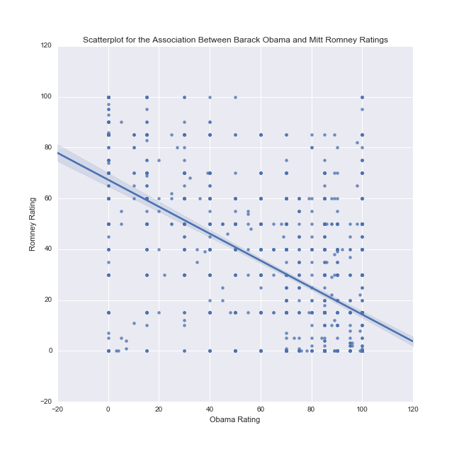
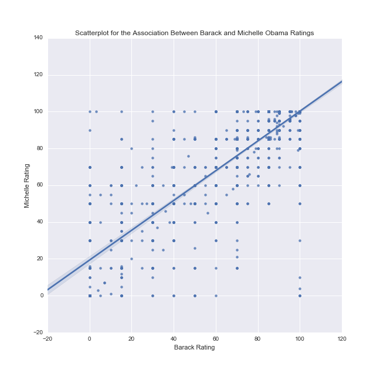

# Pearson's Correlation Coefficient
Is having a high opinion of one candidate for office related to having a low opinion of the other candidate? The
Outlook on Life survey from 2012 asked 18+ Americans to rate Barack Obama and Mitt Romney on a scale from 0 to 100
inclusive. Pearson's r<sup>2</sup> will help us understand the proportion of an American's opinion of Mitt Romney can
be explained by their opinion of Barack Obama.

## Barack Obama and Mitt Romney
There's a strong negative correlation. There's also a funny tendency for people to pick round numbers resulting in a grid of dots.
Support for Barack Obama describes 37% of a person's opionin of Mitt Romney

Pearson's r | Pearson's r<sup>2</sup> | p-value
:---:|:---:|:---:
-0.609727046662 | < 0.001 | 0.371767071431



## Barack and Michelle Obama
Because correlation does not imply causation, I cannot claim Barack is riding Michelle's coattails!

Pearson's r | Pearson's r<sup>2</sup> | p-value
:---:|:---:|:---:
0.863829283947 | < 0.001 | 0.746201031805



# Raw Program Output
```
Outlook on Life Surveys, 2012
rows 2294, columns 436
pearson's r -0.609727046662, p-value 0.000000, r**2 0.371767071431
pearson's r 0.863829283947, p-value 0.000000, r**2 0.746201031805
```

# Program
```
import numpy
import pandas
import seaborn
import matplotlib.pyplot as plt
import scipy

ool = pandas.read_csv('../data/ool_pds.csv', low_memory=False)

print('Outlook on Life Surveys, 2012')
print('rows %d, columns %d' % ool.shape)

RATE_MICHELLE = 'W1_D3'
RATE_MICHELLE_Q = '[Michelle Obama] How would you rate'

RATE_BARACK = 'W1_D1'
RATE_BARACK_Q = '[Barack Obama] How would you rate'

RATE_ROMNEY = 'W1_D2'
RATE_ROMNEY_Q = '[Mitt Romney] How would you rate'

ool = ool.loc[:,[RATE_MICHELLE, RATE_BARACK, RATE_ROMNEY]]


def prepare_rate(data, attr, name):
    data[attr] = pandas.to_numeric(data[attr], errors='coerce')
    data[attr] = data[attr].replace(-1, numpy.nan)
    data[attr] = data[attr].replace(998, numpy.nan)

prepare_rate(ool, RATE_MICHELLE, 'Michelle Obama')
prepare_rate(ool, RATE_BARACK, 'Barack Obama')
prepare_rate(ool, RATE_ROMNEY, 'Mitt Romney')
ool = ool.dropna()

pearson_r, p_value = scipy.stats.pearsonr(ool[RATE_BARACK], ool[RATE_ROMNEY])
print('pearson\'s r %s, p-value %f, r**2 %s' % (pearson_r, p_value, pearson_r**2))
scat1 = seaborn.regplot(x=RATE_BARACK, y=RATE_ROMNEY, fit_reg=True, data=ool)
plt.xlabel('Obama Rating')
plt.ylabel('Romney Rating')
plt.title('Scatterplot for the Association Between Barack Obama and Mitt Romney Ratings')
plt.show()
scat1.get_figure().savefig('BarackMittScatter.png')

pearson_r, p_value = scipy.stats.pearsonr(ool[RATE_BARACK], ool[RATE_MICHELLE])
print('pearson\'s r %s, p-value %f, r**2 %s' % (pearson_r, p_value, pearson_r**2))
scat1 = seaborn.regplot(x=RATE_BARACK, y=RATE_MICHELLE, fit_reg=True, data=ool)
plt.xlabel('Barack Rating')
plt.ylabel('Michelle Rating')
plt.title('Scatterplot for the Association Between Barack and Michelle Obama Ratings')
plt.show()
scat1.get_figure().savefig('BarackMichelleScatter.png')
```
