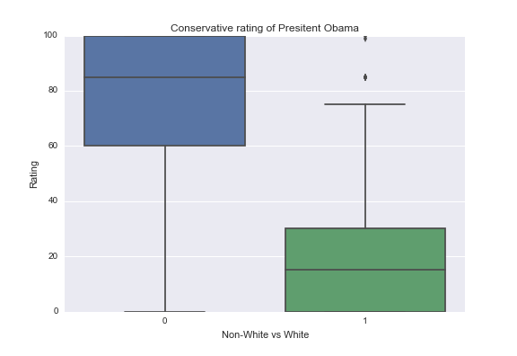

# Ratings of President Obama by Ethnicity are moderated by Political Leaning

The analysis will look at the Rating of President Obama (response) among White and Non-White Americans (explanatory). If there is a correlation we will consider whether Political Leaning has a moderating affect. Data is from the Outlook on Life Survey, 2012. The variables used, their questions and response options, are described in the Univariate Overview section. With a quantitative response and categorical explanatory and moderating variables, all comparisons are done with ANOVA.


Group | Mean | Median | Standard Deviation
--- | ---: | ---: | ---:
All Respondents | 63.8 | 78.9 | 35.7
White | 39.4 | 30 | 34.6
Non-White | 80.4 | 85.0 | 25.4

The difference in means between White and Non-White Americans is significant with a p-value < 0.001. Because there are 4 comparisons made in this analysis, p-values are compared to a Bonferroni Adjusted p-value of 0.05 / 4 = 0.0125.

Does Political Leaning have a moderating effect among white Americans? Let's take a look at ratings among ethnicities of liberal and conservative Americans.



There's an apparent difference in the ratings of the President among white Americans depending on their political leanings. Is it significant?

Group | Mean | Median | Standard Deviation
--- | ---: | ---: | ---:
White | 39.4 | 30 | 34.6
White and Liberal | 74.5 | 80 | 21.5
White and Conservative | 19.8 | 15 | 23.1

Regression comparing mean ratings among white liberal and white conservative Americans reveals a significant difference with a p-value < 0.001. We can conclude that the ratings of President Obama by White Americans is moderated by Political Leaning.

# Univariate Overview

* (W1_D1) How would you rate [Barack Obama] [0 to 100]
* (PPETHM) Race / Ethnicity
  * 1 White, Non-Hispanic
  * 2 Black, Non-Hispanic
  * 3 Other, Non-Hispanic
  * 4 Hispanic
  * 5 2+ Races, Non-Hispanic
* ETHNICITY_2 was created from PPETHM
  * 0 for all Non-White Americans (PPETHM of 2, 3, 4, 5)
  * 1 to White Americans (PPETHM of 1)
* W1_C2 We hear a lot of talk these days about liberals and conservatives. Where would you place YOURSELF on this 7 point scale?
  * 1  Extremely liberal               75      3.3%
  * 2  Liberal                         312    13.6%
  * 3  Slightly liberal                286    12.5%
  * 4  Moderate; middle of the road    874    38.1%
  * 5  Slightly conservative           297    12.9%
  * 6  Conservative                    311    13.6%
  * 7  Extremely conservative          79      3.4%
  * -1 Refused                         60      2.6%
* POLITICAL_2 was created from W1_C2
  * 0 for all liberals (W1_C2 of 1, 2, 3)
  * 1 for all conservatives (W1_C2 of 5, 6, 7)
  * NaN for others (W1_C2 of 5, -1)

# Program Output
```
Data ready. (1309, 5)
    W1_D1  PPETHM  W1_C2  ETHNICITY_2  POLITICAL_2
0     0.0       4    7.0            0          1.0
2    75.0       2    3.0            0          0.0
3    70.0       2    2.0            0          0.0
9    15.0       1    5.0            1          1.0
11   15.0       1    3.0            1          0.0
--------------------------------------------------------------------------------
Race / Ethnicity
1 White, Non-Hispanic
2 Black, Non-Hispanic
3 Other, Non-Hispanic
4 Hispanic
5 2+ Races, Non-Hispanic
Response counts:
PPETHM
4     61
2    671
1    531
5     21
3     25
dtype: int64
Response percentages:
PPETHM
4     4.660046
2    51.260504
1    40.565317
5     1.604278
3     1.909855
dtype: float64
--------------------------------------------------------------------------------
Ethnicity by 1 white and 0 non-white.
Response counts:
ETHNICITY_2
0    778
1    531
dtype: int64
Response percentages:
ETHNICITY_2
0    59.434683
1    40.565317
dtype: float64
--------------------------------------------------------------------------------
We hear a lot of talk these days about liberals and conservatives. Where would you place YOURSELF on this 7 point scale?'
1  Extremely liberal               75      3.3%
2  Liberal                         312    13.6%
3  Slightly liberal                286    12.5%
4  Moderate; middle of the road    874    38.1%
5  Slightly conservative           297    12.9%
6  Conservative                    311    13.6%
7  Extremely conservative          79      3.4%
-1 Refused                         60      2.6%

Response counts:
W1_C2
7.0     75
3.0    275
2.0    300
5.0    286
6.0    304
1.0     69
dtype: int64
Response percentages:
W1_C2
7.0     5.729565
3.0    21.008403
2.0    22.918258
5.0    21.848739
6.0    23.223835
1.0     5.271199
dtype: float64
--------------------------------------------------------------------------------
Political spectrum by 0 liberal and 1 conservative.
Response counts:
POLITICAL_2
1.0    665
0.0    644
dtype: int64
Response percentages:
POLITICAL_2
1.0    50.802139
0.0    49.197861
dtype: float64
count    1309.000000
mean       63.750191
std        35.700882
min         0.000000
25%        30.000000
50%        78.000000
75%        95.000000
max       100.000000
Name: W1_D1, dtype: float64

POLITICAL_2  0.0  1.0
ETHNICITY_2          
0            454  324
1            190  341

ETHNICITY_2       
0            count    778.000000
             mean      80.384319
             std       25.426354
             min        0.000000
             25%       70.000000
             50%       85.000000
             75%      100.000000
             max      100.000000
1            count    531.000000
             mean      39.378531
             std       34.589641
             min        0.000000
             25%        0.000000
             50%       30.000000
             75%       70.000000
             max      100.000000
Name: W1_D1, dtype: float64
                            OLS Regression Results                            
==============================================================================
Dep. Variable:                  W1_D1   R-squared:                       0.318
Model:                            OLS   Adj. R-squared:                  0.318
Method:                 Least Squares   F-statistic:                     610.3
Date:                Sun, 09 Oct 2016   Prob (F-statistic):          6.89e-111
Time:                        20:48:33   Log-Likelihood:                -6286.0
No. Observations:                1309   AIC:                         1.258e+04
Df Residuals:                    1307   BIC:                         1.259e+04
Df Model:                           1                                         
Covariance Type:            nonrobust                                         
=======================================================================================
                          coef    std err          t      P>|t|      [95.0% Conf. Int.]
---------------------------------------------------------------------------------------
Intercept              80.3843      1.057     76.037      0.000        78.310    82.458
C(ETHNICITY_2)[T.1]   -41.0058      1.660    -24.704      0.000       -44.262   -37.750
==============================================================================
Omnibus:                       42.409   Durbin-Watson:                   2.018
Prob(Omnibus):                  0.000   Jarque-Bera (JB):               46.079
Skew:                          -0.459   Prob(JB):                     9.86e-11
Kurtosis:                       2.969   Cond. No.                         2.46
==============================================================================

Warnings:
[1] Standard Errors assume that the covariance matrix of the errors is correctly specified.

ETHNICITY_2       
0            count    454.000000
             mean      86.834802
             std       17.965543
             min        0.000000
             25%       85.000000
             50%       90.000000
             75%      100.000000
             max      100.000000
1            count    190.000000
             mean      74.468421
             std       21.479818
             min        0.000000
             25%       70.000000
             50%       80.000000
             75%       85.000000
             max      100.000000
Name: W1_D1, dtype: float64
                            OLS Regression Results                            
==============================================================================
Dep. Variable:                  W1_D1   R-squared:                       0.081
Model:                            OLS   Adj. R-squared:                  0.079
Method:                 Least Squares   F-statistic:                     56.34
Date:                Sun, 09 Oct 2016   Prob (F-statistic):           2.04e-13
Time:                        20:48:33   Log-Likelihood:                -2811.3
No. Observations:                 644   AIC:                             5627.
Df Residuals:                     642   BIC:                             5636.
Df Model:                           1                                         
Covariance Type:            nonrobust                                         
=======================================================================================
                          coef    std err          t      P>|t|      [95.0% Conf. Int.]
---------------------------------------------------------------------------------------
Intercept              86.8348      0.895     97.035      0.000        85.078    88.592
C(ETHNICITY_2)[T.1]   -12.3664      1.648     -7.506      0.000       -15.602    -9.131
==============================================================================
Omnibus:                      261.880   Durbin-Watson:                   1.958
Prob(Omnibus):                  0.000   Jarque-Bera (JB):              979.186
Skew:                          -1.917   Prob(JB):                    2.36e-213
Kurtosis:                       7.668   Cond. No.                         2.43
==============================================================================

Warnings:
[1] Standard Errors assume that the covariance matrix of the errors is correctly specified.

ETHNICITY_2       
0            count    324.000000
             mean      71.345679
             std       31.017786
             min        0.000000
             25%       60.000000
             50%       85.000000
             75%      100.000000
             max      100.000000
1            count    341.000000
             mean      19.826979
             std       23.175468
             min        0.000000
             25%        0.000000
             50%       15.000000
             75%       30.000000
             max      100.000000
Name: W1_D1, dtype: float64
                            OLS Regression Results                            
==============================================================================
Dep. Variable:                  W1_D1   R-squared:                       0.472
Model:                            OLS   Adj. R-squared:                  0.471
Method:                 Least Squares   F-statistic:                     592.6
Date:                Sun, 09 Oct 2016   Prob (F-statistic):           5.23e-94
Time:                        20:48:33   Log-Likelihood:                -3141.2
No. Observations:                 665   AIC:                             6286.
Df Residuals:                     663   BIC:                             6295.
Df Model:                           1                                         
Covariance Type:            nonrobust                                         
=======================================================================================
                          coef    std err          t      P>|t|      [95.0% Conf. Int.]
---------------------------------------------------------------------------------------
Intercept              71.3457      1.516     47.077      0.000        68.370    74.321
C(ETHNICITY_2)[T.1]   -51.5187      2.116    -24.343      0.000       -55.674   -47.363
==============================================================================
Omnibus:                       20.114   Durbin-Watson:                   2.117
Prob(Omnibus):                  0.000   Jarque-Bera (JB):               21.608
Skew:                          -0.393   Prob(JB):                     2.03e-05
Kurtosis:                       3.404   Cond. No.                         2.65
==============================================================================

Warnings:
[1] Standard Errors assume that the covariance matrix of the errors is correctly specified.
POLITICAL_2       
0.0          count    190.000000
             mean      74.468421
             std       21.479818
             min        0.000000
             25%       70.000000
             50%       80.000000
             75%       85.000000
             max      100.000000
1.0          count    341.000000
             mean      19.826979
             std       23.175468
             min        0.000000
             25%        0.000000
             50%       15.000000
             75%       30.000000
             max      100.000000
Name: W1_D1, dtype: float64
                            OLS Regression Results                            
==============================================================================
Dep. Variable:                  W1_D1   R-squared:                       0.574
Model:                            OLS   Adj. R-squared:                  0.574
Method:                 Least Squares   F-statistic:                     714.2
Date:                Sun, 09 Oct 2016   Prob (F-statistic):          3.19e-100
Time:                        20:48:34   Log-Likelihood:                -2407.7
No. Observations:                 531   AIC:                             4819.
Df Residuals:                     529   BIC:                             4828.
Df Model:                           1                                         
Covariance Type:            nonrobust                                         
=========================================================================================
                            coef    std err          t      P>|t|      [95.0% Conf. Int.]
-----------------------------------------------------------------------------------------
Intercept                74.4684      1.638     45.451      0.000        71.250    77.687
C(POLITICAL_2)[T.1.0]   -54.6414      2.045    -26.725      0.000       -58.658   -50.625
==============================================================================
Omnibus:                       26.496   Durbin-Watson:                   1.897
Prob(Omnibus):                  0.000   Jarque-Bera (JB):               44.236
Skew:                           0.357   Prob(JB):                     2.48e-10
Kurtosis:                       4.220   Cond. No.                         3.10
==============================================================================

Warnings:
[1] Standard Errors assume that the covariance matrix of the errors is correctly specified.
```

# Program
```
import numpy as np
import pandas as pd
import statsmodels.formula.api as smf 
import statsmodels.stats.multicomp as multi
import seaborn
import matplotlib.pyplot as plt

RATE_BARACK = 'W1_D1'
RATE_BARACK_Q = 'How would you rate [Barack Obama] [0 to 100]'

ETHNICITY = 'PPETHM'
ETHNICITY_Q = """Race / Ethnicity
1 White, Non-Hispanic
2 Black, Non-Hispanic
3 Other, Non-Hispanic
4 Hispanic
5 2+ Races, Non-Hispanic"""


def assign_ethnicity_2(row):
    ethnicity_cat = row[ETHNICITY]
    if ethnicity_cat == 1:
        return 1
    elif ethnicity_cat > 1:
        return 0
    else:
        return np.nan

POLITICAL_SPECTRUM = 'W1_C2'
POLITICAL_SPECTRUM_Q = """We hear a lot of talk these days about liberals and conservatives. Where would you place YOURSELF on this 7 point scale?'
1  Extremely liberal               75      3.3%
2  Liberal                         312    13.6%
3  Slightly liberal                286    12.5%
4  Moderate; middle of the road    874    38.1%
5  Slightly conservative           297    12.9%
6  Conservative                    311    13.6%
7  Extremely conservative          79      3.4%
-1 Refused                         60      2.6%
"""


def assign_political_2(row):
    political_cat = row[POLITICAL_SPECTRUM]
    if political_cat < 4:
        return 0 # left of center
    elif political_cat > 4:
        return 1 # right of center
    else:
        return np.nan


def prepare_rate(data, attr):
    data[attr] = pd.to_numeric(data[attr], errors='coerce')
    data[attr] = data[attr].replace(-1, np.nan)
    data[attr] = data[attr].replace(998, np.nan)


def prepare_numeric_category(data, attr):
    data[attr] = pd.to_numeric(data[attr], errors='coerce')
    data[attr] = data[attr].replace(-1, np.nan)

ool_raw = pd.read_csv('../data/ool_pds.csv')[[RATE_BARACK, ETHNICITY, POLITICAL_SPECTRUM]]
prepare_numeric_category(ool_raw, ETHNICITY)
prepare_numeric_category(ool_raw, POLITICAL_SPECTRUM)
prepare_rate(ool_raw, RATE_BARACK)
ool_raw['ETHNICITY_2'] = ool_raw.apply(assign_ethnicity_2, axis=1)
ool_raw['POLITICAL_2'] = ool_raw.apply(assign_political_2, axis=1)
ool = ool_raw.dropna()
print('Data ready. %s' % ((ool.shape,)))
print(ool.head())


def summarize(data, attr, desc):
    counts = data.groupby(attr, sort=False).size()
    relative = counts * 100 / len(data)
    print('-'*80)
    print(desc)
    print('Response counts:')
    print(counts)
    print('Response percentages:')
    print(relative)

# Univariate overview.
summarize(ool, ETHNICITY, ETHNICITY_Q)
summarize(ool, 'ETHNICITY_2', 'Ethnicity by 1 white and 0 non-white.')
summarize(ool, POLITICAL_SPECTRUM, POLITICAL_SPECTRUM_Q)
summarize(ool, 'POLITICAL_2', 'Political spectrum by 0 liberal and 1 conservative.')
print(ool[RATE_BARACK].describe())
rating_boxplot = seaborn.boxplot(y=RATE_BARACK, data=ool)
plt.ylabel('Rating')
plt.title('American\'s rating of Presitent Obama')
plt.show()
rating_boxplot.get_figure().savefig('RATE_BARACK-boxplot.png')

# Bivariate overview.
print(pd.crosstab(ool['ETHNICITY_2'], ool['POLITICAL_2']))


# Obama's rating by race. Obama's rating by race for Dem vs Rep.
def investigate_rating_by_ethnicity(data, desc):
    rating_by_ethnicity_boxplot = seaborn.boxplot(x='ETHNICITY_2', y=RATE_BARACK, data=data)
    plt.xlabel('Non-White vs White')
    plt.ylabel('Rating')
    plt.title('%s rating of Presitent Obama' % desc)
    plt.show()
    rating_by_ethnicity_boxplot.get_figure().savefig('%s-boxplot.png' % desc)
    print(data.groupby('ETHNICITY_2')[RATE_BARACK].describe())
    regression = smf.ols(formula='%s ~ C(ETHNICITY_2)' % RATE_BARACK, data=data).fit()
    print(regression.summary())

# 1. Regression RATING_OBAMA explained by ETHNICITY.
#    * means per ETHNICITY
#    * stdev per ETHNICITY
investigate_rating_by_ethnicity(ool, 'FullPopulation')

# 2. Subset by party affiliation.
liberal_ool = ool[ ool['POLITICAL_2'] == 0 ]
conservative_ool = ool[ ool['POLITICAL_2'] == 1 ]

# 3. Show that the relationship is different in each subset.
#    * repeat step 1
investigate_rating_by_ethnicity(liberal_ool, 'Liberal')
investigate_rating_by_ethnicity(conservative_ool, 'Conservative')

# Now compare white liberals and white conservatives.
white_ool = ool[ ool['ETHNICITY_2'] == 1 ]
rating_by_political_2_among_whites_boxplot = seaborn.boxplot(x='POLITICAL_2', y=RATE_BARACK, data=white_ool)
plt.xlabel('Liberal vs Conservative')
plt.ylabel('Rating')
plt.title('Rating of President Obama by White Americans')
rating_by_political_2_among_whites_boxplot.get_figure().savefig('white-rating-by-political.png')
print(white_ool.groupby('POLITICAL_2')[RATE_BARACK].describe())
regression = smf.ols(formula='%s ~ C(POLITICAL_2)' % RATE_BARACK, data=white_ool).fit()
print(regression.summary())
```
