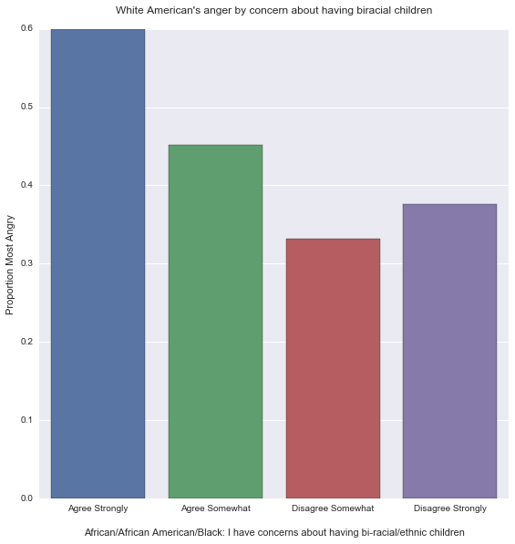
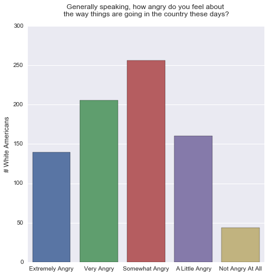
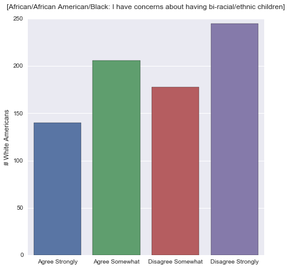
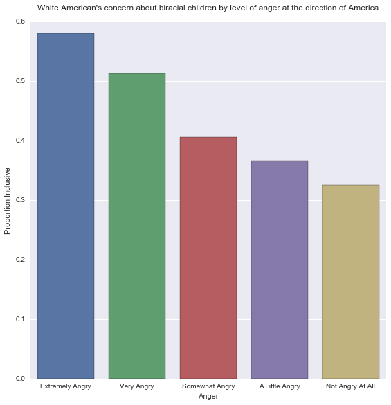

# Summary of Week 4

Americans where surveyed on political views and general outlook. Among the questions, they were asked the following.
* African/African American/Black: I have concerns about having bi-racial/ethnic children (W1_E61_C)
  * -1 Refused, 1  Agree Strongly, 2  Agree Somewhat, 3  Disagree Somewhat, 4  Disagree Strongly
* Generally speaking, how angry do you feel about the way things are going in the country these days? (W1_B4)
  * -1 Refused, 1  Extremely angry, 2  Very angry, 3  Somewhat angry, 4  A little angry, 5  Not angry at all
* Race / Ethnicity (PPETHM)
  * 1 White, Non-Hispanic, 2 Black, Non-Hispanic, 3 Other, Non-Hispanic, 4 Hispanic, 5 2+ Races, Non-Hispanic

# Bivariate Comparison
There is a trend of unknown significance where white Americans that are most concerned about having biracial children are more angry about the way things are going in America.

The W1_B4 variable on anger has been transformed into "Most Angry". A 1 for Extremely and Very angry and a 0 for the less angry categories.

By themselves, "Anger" is roughly unimodal and symetric while "Biracial Children" is bimodal and not symetric.


# Univariate Graphs





# Program Output
```
Outlook on Life Surveys, 2012
Count of rows 2294
Count of columns 436
Limiting to 814 responses from white Americans
Define IN_EX_CLUSIVE (inclusive vs exclusive) by views on mixed race children.
Define IN_EX_CLUSIVE_QUANT as the 0/1 version of IN_EX_CLUSIVE.
Definte MOST_ANGRY as respondants that are Extremely or Very Angry.
Definte MOST_ANGRY as respondants that are Extremely or Very Angry.


---------------------------------------------------------------------------
Calculated inclusive column 0/1
Response counts:
IN_EX_CLUSIVE_QUANT
1.0    346
0.0    423
dtype: int64
Response percentages:
IN_EX_CLUSIVE_QUANT
1.0    42.506143
0.0    51.965602
dtype: float64


---------------------------------------------------------------------------
Calculated most angry column 0/1
Response counts:
MOST_ANGRY
0    468
1    346
dtype: int64
Response percentages:
MOST_ANGRY
0    57.493857
1    42.506143
dtype: float64


---------------------------------------------------------------------------
Break down President Obama's approval rating by IN_EX_CLUSIVE and MOST_ANGRY.
(Within W1_A12: 1 is approve, 2 is disapprove)
Counts
W1_A12                    1.0  2.0
IN_EX_CLUSIVE MOST_ANGRY          
exclusive     0            80   88
              1            29  146
inclusive     0           160  111
              1            40  108
Percentages
W1_A12                          1.0        2.0
IN_EX_CLUSIVE MOST_ANGRY                      
exclusive     0           47.619048  52.380952
              1           16.571429  83.428571
inclusive     0           59.040590  40.959410
              1           27.027027  72.972973


---------------------------------------------------------------------------
Comparison of Anger among Inclusive and Exclusive white Americans. (crosstab IN_EX_CLUSIVE * W1_B4).
Counts
W1_B4          1.0  2.0  3.0  4.0  5.0
IN_EX_CLUSIVE                         
exclusive       76  101   99   56   14
inclusive       55   96  145   97   29
Percentages
W1_B4                1.0        2.0        3.0        4.0       5.0
IN_EX_CLUSIVE                                                      
exclusive      21.965318  29.190751  28.612717  16.184971  4.046243
inclusive      13.033175  22.748815  34.360190  22.985782  6.872038


---------------------------------------------------------------------------
Comparison of Anger by views on Biracial Children. (crosstab W1_E61_C * W1_B4).
Counts
W1_B4     1.0  2.0  3.0  4.0  5.0
W1_E61_C                         
1.0        38   46   31   22    3
2.0        38   55   68   34   11
3.0        20   39   67   42   10
4.0        35   57   78   55   19
Percentages
W1_B4           1.0        2.0        3.0        4.0       5.0
W1_E61_C                                                      
1.0       27.142857  32.857143  22.142857  15.714286  2.142857
2.0       18.446602  26.699029  33.009709  16.504854  5.339806
3.0       11.235955  21.910112  37.640449  23.595506  5.617978
4.0       14.344262  23.360656  31.967213  22.540984  7.786885
```





# Program
```
import numpy
import pandas
import seaborn
import matplotlib.pyplot as plt

ool = pandas.read_csv('../data/ool_pds.csv', low_memory=False)

print('Outlook on Life Surveys, 2012')
print('Count of rows %d' % len(ool))
print('Count of columns %d' % len(ool.columns))

ETHNICITY = 'PPETHM'
ETHNICITY_Q = """Race / Ethnicity
1 White, Non-Hispanic
2 Black, Non-Hispanic
3 Other, Non-Hispanic
4 Hispanic
5 2+ Races, Non-Hispanic"""

ANGER = 'W1_B4'
ANGER_Q = """Generally speaking, how angry do you feel about the way things are going in the
country these days?
-1 Refused
1  Extremely angry
2  Very angry
3  Somewhat angry
4  A little angry
5  Not angry at all"""

GENDER = 'PPGENDER'
GENDER_Q = """Gender
1 Male
2 Female"""

GO_BLACK = 'W1_E5_1'
GO_BLACK_Q = """[African/African American/Black] Which racial and ethnic groups would you or
have you dated?
0 No
1 Yes"""

ATTRACT_BLACK = 'W1_E61_A'
ATTRACT_BLACK_Q = """[African/African American/Black: They are physically attractive] How do you
rate each of the following groups on these characteristics?
1 Agree Strongly
2 Agree Somewhat
3 Disagree Somewhat"""

APPROVE_BLACK = 'W1_E61_B'
APPROVE_BLACK_Q = """[African/African American/Black: My family, friends, relatives would not approve]
How do you rate each of the following groups on these characteristics?
-1 Refused
1  Agree Strongly
2  Agree Somewhat
3  Disagree Somewhat
4  Disagree Strongly"""

CHILD_BLACK = 'W1_E61_C'
CHILD_BLACK_Q =  """[African/African American/Black: I have concerns about having bi-racial/ethnic children]
How do you rate each of the following groups
on these characteristics?
-1 Refused
1  Agree Strongly
2  Agree Somewhat
3  Disagree Somewhat
4  Disagree Strongly"""

APPROVE_OBAMA = 'W1_A12'
APPROVE_OBAMA_Q = """Do you approve or disapprove of the way Barack Obama is handling his job as President?
-1 Refused
1  Approve
2  Disapprove
"""

def prepareNumeric(data, attr):
    data[attr] = pandas.to_numeric(data[attr], errors='coerce')
    data[attr] = data[attr].replace(-1, numpy.nan)

prepareNumeric(ool, ANGER)
prepareNumeric(ool, CHILD_BLACK)
prepareNumeric(ool, APPROVE_OBAMA)

whites = ool[(ool[ETHNICITY] == 1)].copy()
print('Limiting to %d responses from white Americans' % len(whites))

print('Define IN_EX_CLUSIVE (inclusive vs exclusive) by views on mixed race children.')
def inclusive_or_exclusive(row):
    if row[CHILD_BLACK] == 1 or row[CHILD_BLACK] == 2:
        return 'exclusive'
    elif row[CHILD_BLACK] == 3 or row[CHILD_BLACK] == 4:
        return 'inclusive'
    else:
        numpy.nan
whites['IN_EX_CLUSIVE'] = whites.apply(inclusive_or_exclusive, axis=1)

print('Define IN_EX_CLUSIVE_QUANT as the 0/1 version of IN_EX_CLUSIVE.')
def inclusive_or_exclusive_quant(row):
    category = inclusive_or_exclusive(row)
    if category == 'exclusive':
        return 1
    if category == 'inclusive':
        return 0
    else:
        numpy.nan
whites['IN_EX_CLUSIVE_QUANT'] = whites.apply(inclusive_or_exclusive_quant, axis=1)

print('Definte MOST_ANGRY as respondants that are Extremely or Very Angry.')
def most_angry(row):
    # 1: Extremely or Very Angry
    # 0: Somewhat, A little, or Not Angry
    return row[ANGER] == 1 or row[ANGER] == 2
whites['MOST_ANGRY'] = whites.apply(most_angry, axis=1)

print('Definte MOST_ANGRY as respondants that are Extremely or Very Angry.')
def most_angry(row):
    # 1: Extremely or Very Angry
    # 0: Somewhat, A little, or Not Angry
    if row[ANGER] == 1 or row[ANGER] == 2:
        return 1
    else:
        return 0
whites['MOST_ANGRY'] = whites.apply(most_angry, axis=1)

def print_divider():
    print('\n\n' + '-'*75)

def summarize(data, attr, desc):
    counts = data.groupby(attr, sort=False).size()
    relative = counts * 100 / len(data)
    print_divider()
    print(desc)
    print('Response counts:')
    print(counts)
    print('Response percentages:')
    print(relative)
summarize(whites, 'IN_EX_CLUSIVE_QUANT', 'Calculated inclusive column 0/1')
summarize(whites, 'MOST_ANGRY', 'Calculated most angry column 0/1')

def crosstab_summarize(data, attr1, attr2, title):
    print_divider()
    print('%s (crosstab %s * %s).' % (title, attr1, attr2))
    crosstab = pandas.crosstab(data[attr1], data[attr2])
    relative_crosstab = crosstab.apply(lambda r: 100*r/r.sum(), axis=1)
    print('Counts')
    print(crosstab)
    print('Percentages')
    print(relative_crosstab)
    
crosstab = pandas.crosstab([whites['IN_EX_CLUSIVE'], whites['MOST_ANGRY']], whites[APPROVE_OBAMA])
normalized_crosstab = crosstab.apply(lambda r: 100*r/r.sum(), axis=1)
print_divider()
print('Break down President Obama\'s approval rating by IN_EX_CLUSIVE and MOST_ANGRY.')
print('(Within %s: 1 is approve, 2 is disapprove)' % APPROVE_OBAMA)
print('Counts')
print(crosstab)
print('Percentages')
print(normalized_crosstab)

crosstab_summarize(whites, 'IN_EX_CLUSIVE', ANGER, 'Comparison of Anger among Inclusive and Exclusive white Americans.')
crosstab_summarize(whites, CHILD_BLACK, ANGER, 'Comparison of Anger by views on Biracial Children.')

def as_category(data, attr, names): 
  data[attr] = data[attr].astype('category')
  data[attr] = data[attr].cat.rename_categories(names)

# Figure sizes in inches. For some reason this does not apply to the factorplot.
seaborn.mpl.rc("figure", figsize=(7,7))

as_category(whites, CHILD_BLACK, ["Agree Strongly", "Agree Somewhat", "Disagree Somewhat", "Disagree Strongly"])
seaborn.countplot(x=CHILD_BLACK, data=whites)
plt.title('[African/African American/Black: I have concerns about having bi-racial/ethnic children]\n')
plt.xlabel('')
plt.ylabel('# White Americans')
plt.show()

as_category(whites, ANGER, ['Extremely Angry', 'Very Angry', 'Somewhat Angry', 'A Little Angry', 'Not Angry At All'])
seaborn.countplot(x=ANGER, data=whites)
plt.title('Generally speaking, how angry do you feel about \nthe way things are going in the country these days?\n')
plt.xlabel('')
plt.ylabel('# White Americans')
plt.show()

seaborn.factorplot(x=ANGER, y='IN_EX_CLUSIVE_QUANT', data=whites, kind="bar", ci=None, size=8)
plt.xlabel('Anger')
plt.ylabel('Proportion Inclusive')
plt.title('White American\'s concern about biracial children by level of anger at the direction of America\n')
plt.show()

seaborn.factorplot(x=CHILD_BLACK, y='MOST_ANGRY', data=whites, kind="bar", ci=None, size=8)
plt.xlabel('\nAfrican/African American/Black: I have concerns about having bi-racial/ethnic children')
plt.ylabel('Proportion Most Angry')
plt.title('White American\'s anger by concern about having biracial children\n')
plt.show()
```
