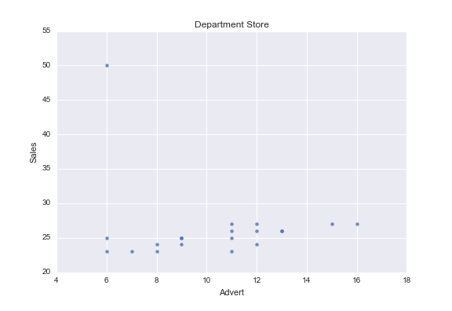
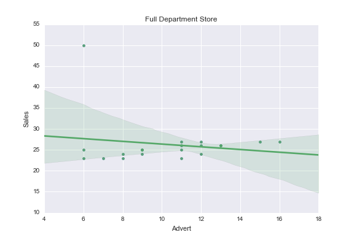
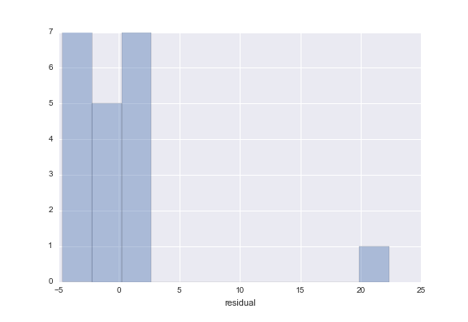
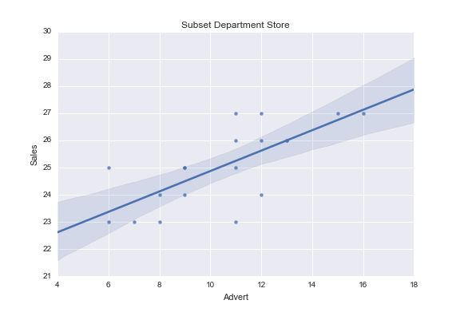

# Econometrics Week 1 Test

Calculations are done by the python program that can be found at the end of this document.

#### (a) Make the scatter diagram with sales on the vertical axis and advertising on the horizontal axis. What do you expect to find if you would fit a regression line to these data?



#### (b) Estimate the coefficients a and b in the simple regression model with sales as dependent variable and advertising as explanatory factor. Also compute the standard error and t-value of b. Is b significantly different from 0?

Coefficient | Estimate | Std Error | t-value
:--- | ---: | ---: | ---:
a | 29.6269 | 4.882 | 6.069
b | -0.3246 | 0.459 | -0.707

With a t-statistic of -0.707, we cannot reject the null hypothesis that b is significantly different than 0.



#### (c) Compute the residuals and draw a histogram of these residuals. What conclusion do you draw from this histogram?



#### (d) Apparently, the regression result of part (b) is not satisfactory. Once you realize that the large residual corresponds to the week with opening hours during the evening, how would you proceed to get a more satisfactory regression model?

We need to delete the outlier because it is different for a reason that does not apply to the values we want to predict.

#### (e) Delete this special week from the sample and use the remaining 19 weeks to estimate the coefficients a and b in the simple regression model with sales as dependent variable and advertising as explanatory factor. Also compute the standard error and t-value of b. Is b significantly different from 0?

Coefficient | Estimate | Std Error | t-value
:--- | ---: | ---: | ---:
a | 21.1250 | 0.955 | 22.124
b | 0.3750 | 0.088 | 4.252

With a t-statistic of 4.252, we can reject the null hypothesis and conclude that b is significantly different from 0.



#### (f) Discuss the differences between your findings in parts (b) and (e). Describe in words what you have learned from these results.

We see in this data set how a single outlier can hide a significant correlation. When that outlier is different for a reason that does not apply to the rest of the data set or the events we want to predict, it can reasonably be removed. In the case of this department store, an astute observation indicates value in marketing that would have remained hidden otherwise.

# Calculations
```
import pandas as pd
import seaborn
import matplotlib.pyplot as plt

data = pd.read_csv('./TestExer1-sales-round1.txt', low_memory=False, delimiter='\t')
print(data.head())

# (a) Make the scatter diagram with sales on the vertical axis and advertising on the horizontal axis. What do you expect to find if you would fit a regression line to these data?

scatter_plot = seaborn.regplot(x=data['Advert'], y=data['Sales'], fit_reg=False, data=data)
plt.title('Department Store')
scatter_plot.get_figure().savefig('Advert-Sales-scatter.png')

# (b) Estimate the coefficients a and b in the simple regression model with sales as dependent variable and advertising as explanatory factor. Also compute the standard error and t-value of b. Is b significantly different from 0?

def regres(subset, desc):
  regression = smf.ols('Sales ~ Advert', data=subset).fit()
  subset['residual'] = regression.resid
  print(regression.summary())
  scatter_plot = seaborn.regplot(x=subset['Advert'], y=subset['Sales'], fit_reg=True, data=subset)
  plt.title('%s Department Store' % desc)
  plt.show()
  scatter_plot.get_figure().savefig('%s-regression.png' % desc)
  return regression

regres(data, 'Full')

# (c) Compute the residuals and draw a histogram of these residuals. What conclusion do you draw from this histogram?

residual_distplot = seaborn.distplot(data['residual'], kde=False);
residual_distplot.get_figure().savefig('residual-histogram.png')
plt.title('Residual: One is not like the others.')
plt.show()

# (d) Apparently, the regression result of part (b) is not satisfactory. Once you realize that the large residual corresponds to the week with opening hours during the evening, how would you proceed to get a more satisfactory regression model?

print('(d) Delete the outlier because it is different for a reason that does not apply to the events we want to predict.')

# (e) Delete this special week from the sample and use the remaining 19 weeks to estimate the coefficients a and b in the simple regression model with sales as dependent variable and advertising as explanatory factor. Also compute the standard error and t-value of b. Is b significantly different from 0?

subset = data[ data['Sales'] < 50 ].copy()
regres(subset, 'Subset')
```
