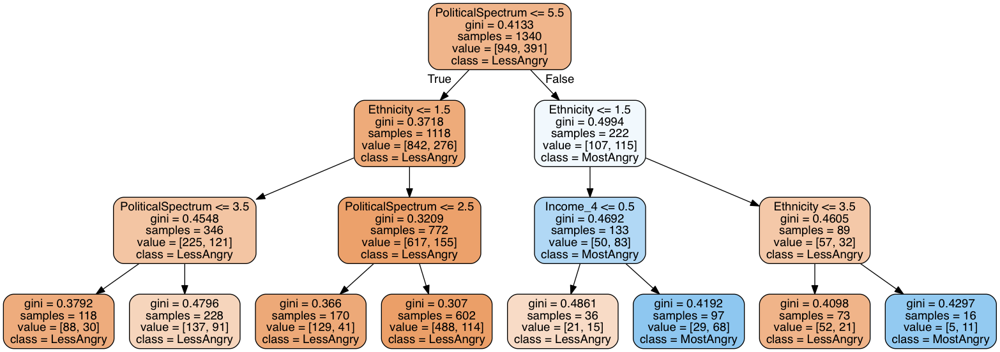
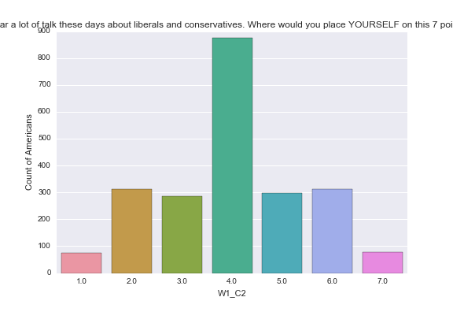
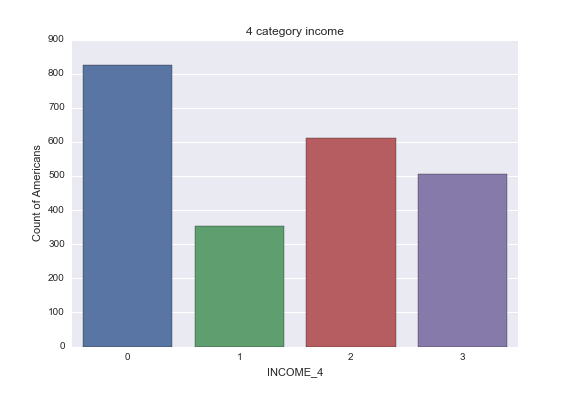
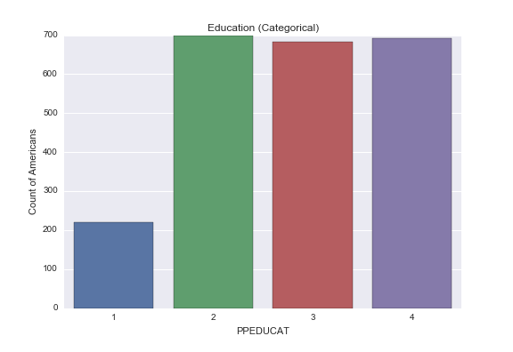
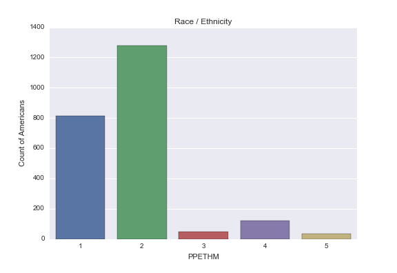
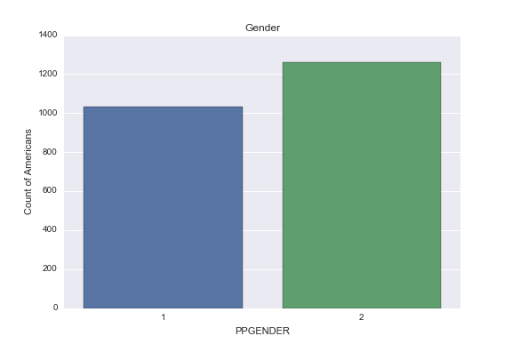
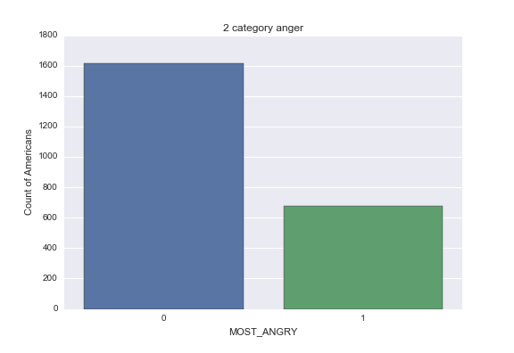

# Decision Tree to Predict Anger

Generally speaking, how angry do you feel about the way things are going in the country these days?

This decision tree attempts to answer the previous question with data from the Outlook On Life Survey, 2012. The predictors (explanatory variables) are political spectrum, education, gender, ethnicity, and income. The target (response variable) are two columns representing the most and least angry respondents.

The algorithm is described in detail in the [scipy documentation](http://scikit-learn.org/stable/modules/tree.html) and [wikipedia](https://en.wikipedia.org/wiki/Predictive_analytics#Classification_and_regression_trees_.28CART.29). The model is limited to a depth of 3 and a minimum leaf size of 5 resulting in 7 decision nodes. Political spectrum is used by 2 nodes, ethnicity by 3 nodes, and education and income are used once each.

Because the response categories are split 70% Less Angry and 30% Most Angry,  the algorithm can be 72% accurate by classifying 89% of respondents as Less Angry.

The only two groups predicted to be most angry are 97 (poor AND white AND conservative) and 16 (Hispanic or 2+ ethnicity AND conservative).



# Parameter questions, responses, and counts

#### We hear a lot of talk these days about liberals and conservatives. Where would you place YOURSELF on this 7 point scale?

* 1 Extremely liberal
* 2 Liberal
* 3 Slightly liberal
* 4 Moderate; middle of the road
* 5 Slightly conservative
* 6 Conservative
* 7 Extremely conservative
* 1 Refused 60 2.6%



#### Which of the following income groups includes YOUR personal annual income (Do not include the income of other members of your household)?

* 1 Less than $5,000
* 2 $5,000 to $7,499
* 3 $7,500 to $9,999
* 4 $10,000 to $12,499
* 5 $12,500 to $14,999
* 6 $15,000 to $19,999
* 7 $20,000 to $24,999
* 8 $25,000 to $29,999
* 9 $30,000 to $34,999
* 10 $35,000 to $39,999
* 11 $40,000 to $49,999
* 12 $50,000 to $59,999
* 13 $60,000 to $74,999
* 14 $75,000 to $84,999
* 15 $85,000 to $99,999
* 16 $100,000 to $124,999
* 17 $125,000 to $149,999
* 18 $150,000 to $174,999
* 19 $175,000 or more
* -1 Refused 202 8.8 %



#### Education

* 1 Less than high school
* 2 High school
* 3 Some college
* 4 Bachelor's degree or higher



#### Race / Ethnicity

* 1 White, Non-Hispanic
* 2 Black, Non-Hispanic
* 3 Other, Non-Hispanic
* 4 Hispanic
* 5 2+ Races, Non-Hispanic



#### Gender

* 1 Male
* 2 Female



#### Generally speaking, how angry do you feel about the way things are going in the country these days?

- 1 Extremely Angry
- 2 Very Angry
- 3 Somewhat Angry
- 4 A Little Angry
- 5 Not Angry at All

In the analysis, as shown in the graph below, these categories have been collapsed to 1: Extremely and Very Angry and 0: Somewhat, A Little, Not at All Angry.



# Program Output
```
Outlook on Life Surveys, 2012 (2294, 436)
Define MOST_ANGRY as respondents that are Extremely or Very Angry.
Define ANGER_3 as the ANGER column divided into 3 categories.
Define INCOME_4 as the INCOME column divided into 4 categories.
Define AGE_3 as the AGE column divided into 3 categories.

<Univariate counts are here.>

Data ready (2234, 6).
  W1_C2 PPEDUCAT PPGENDER  PPETHM INCOME_4 MOST_ANGRY
0   7.0        2        2       4        2          0
1   4.0        1        1       2        0          0
2   3.0        4        1       2        3          0
3   2.0        4        1       2        0          0
4   4.0        4        2       1        2          0
W1_C2         category
PPEDUCAT      category
PPGENDER      category
PPETHM           int64
INCOME_4      category
MOST_ANGRY    category
dtype: object
            PPETHM
count  2234.000000
mean      1.806177
std       0.823707
min       1.000000
25%       1.000000
50%       2.000000
75%       2.000000
max       5.000000
[[598  23]
 [223  50]]
0.724832214765
Done. Check political-decision-tree.png
```

# Program
```
import pandas as pd
import numpy as np
import seaborn
import matplotlib.pyplot as plt
from sklearn.cross_validation import train_test_split
from sklearn.tree import DecisionTreeClassifier
import sklearn.metrics
from sklearn import tree
from io import StringIO
import pydotplus

ANGER = 'W1_B4'
ANGER_Q = """Generally speaking, how angry do you feel about the way things are going in the
country these days?
-1 Refused
1  Extremely angry
2  Very angry
3  Somewhat angry
4  A little angry
5  Not angry at all"""


def most_angry(row):
    # 1: Extremely or Very Angry
    # 0: Somewhat, A little, or Not Angry
    if row[ANGER] == 1 or row[ANGER] == 2:
        return 1
    else:
        return 0


def collapse_anger(row):
    anger_cat = row[ANGER]
    if anger_cat <= 2:
        return 0
    elif anger_cat == 3:
        return 1
    else:
        return 2

POLITICAL_SPECTRUM = 'W1_C2'
POLITICAL_SPECTRUM_Q = """We hear a lot of talk these days about liberals and conservatives. Where would you place YOURSELF on this 7 point scale?'
1  Extremely liberal               75      3.3%
2  Liberal                         312    13.6%
3  Slightly liberal                286    12.5%
4  Moderate; middle of the road    874    38.1%
5  Slightly conservative           297    12.9%
6  Conservative                    311    13.6%
7  Extremely conservative          79      3.4%
-1 Refused                         60      2.6%
"""

INCOME = 'W1_P20'
INCOME_Q = """Which of the following income groups includes YOUR personal annual income (Do not include the income of other members of your household)?
1  Less than $5,000       261   11.4 %
2  $5,000 to $7,499        72    3.1 %
3  $7,500 to $9,999        58    2.5 %
4  $10,000 to $12,499     107    4.7 %
5  $12,500 to $14,999      87    3.8 %
6  $15,000 to $19,999      91    4.0 %
7  $20,000 to $24,999     149    6.5 %
8  $25,000 to $29,999     127    5.5 %
9  $30,000 to $34,999     118    5.1 %
10 $35,000 to $39,999     107    4.7 %
11 $40,000 to $49,999     174    7.6 %
12 $50,000 to $59,999     166    7.2 %
13 $60,000 to $74,999     185    8.1 %
14 $75,000 to $84,999      86    3.7 %
15 $85,000 to $99,999      81    3.5 %
16 $100,000 to $124,999   114    5.0 %
17 $125,000 to $149,999    38    1.7 %
18 $150,000 to $174,999    44    1.9 %
19 $175,000 or more        27    1.2 %
-1 Refused                202    8.8 %
"""


def collapse_income(row):
    income_cat = row[INCOME]
    if income_cat <= 7:
        return 0
    elif income_cat <= 10:
        return 1
    elif income_cat <= 14:
        return 2
    else:
        return 3

AGE = 'PPAGECAT'
AGE_Q = """Age - 7 Categories
1 18-24   237   10.3 %
2 25-34   289   12.6 %
3 35-44   360   15.7 %
4 45-54   457   19.9 %
5 55-64   514   22.4 %
6 65-74   329   14.3 %
7 75+     108   4.7 %
99 Under   18   0 0.0 %
"""


def collapse_age(row):
    age_cat = row[AGE]
    if age_cat <= 2:
        return 0
    elif age_cat <= 4:
        return 1
    else:
        return 2

EDUCATION = 'PPEDUCAT'
EDUCATION_Q = """Education (Categorical)
1 Less than high school         219  9.5 %
2 High school                   700 30.5%
3 Some college                  682 29.7%
4 Bachelor's degree or higher   693 30.2%
"""

ETHNICITY = 'PPETHM'
ETHNICITY_Q = """Race / Ethnicity
1 White, Non-Hispanic
2 Black, Non-Hispanic
3 Other, Non-Hispanic
4 Hispanic
5 2+ Races, Non-Hispanic"""

GENDER = 'PPGENDER'
GENDER_Q = """Gender
1 Male 1032 45.0 %
2 Female 1262 55.0 %
"""


def summarize(data, attr, desc):
    # counts = data.groupby(attr, sort=False).size()
    # relative = counts * 100 / len(data)
    # print('-' * 80)
    # print(desc)
    # print('Response counts:')
    # print(counts)
    # print('Response percentages:')
    # print(relative)
    count_plot = seaborn.countplot(x=attr, data=data)
    plt.title(desc.split('\n')[0])
    plt.xlabel(attr)
    plt.ylabel('Count of Americans')
    plt.show()
    count_plot.get_figure().savefig('%s-countplot.png' % attr)


def prepare_numeric_category(data, attr):
    data[attr] = pd.to_numeric(data[attr], errors='coerce')
    data[attr] = data[attr].replace(-1, np.nan)
    data[attr] = data[attr].astype('category')


# Load and transform data
ool = pd.read_csv('../data/ool_pds.csv', low_memory=False)
print('Outlook on Life Surveys, 2012 %s' % (ool.shape,))
prepare_numeric_category(ool, POLITICAL_SPECTRUM)
prepare_numeric_category(ool, INCOME)
prepare_numeric_category(ool, AGE)
prepare_numeric_category(ool, EDUCATION)
prepare_numeric_category(ool, GENDER)
prepare_numeric_category(ool, ANGER)

print('Define MOST_ANGRY as respondents that are Extremely or Very Angry.')
ool['MOST_ANGRY'] = ool.apply(most_angry, axis=1)
prepare_numeric_category(ool, 'MOST_ANGRY')

print('Define ANGER_3 as the ANGER column divided into 3 categories.')
ool['ANGER_3'] = ool.apply(collapse_anger, axis=1)
prepare_numeric_category(ool, 'ANGER_3')

print('Define INCOME_4 as the INCOME column divided into 4 categories.')
ool['INCOME_4'] = ool.apply(collapse_income, axis=1)
prepare_numeric_category(ool, 'INCOME_4')

print('Define AGE_3 as the AGE column divided into 3 categories.')
ool['AGE_3'] = ool.apply(collapse_age, axis=1)
prepare_numeric_category(ool, 'AGE_3')

# Univariate summaries
summarize(ool, INCOME, INCOME_Q)
summarize(ool, AGE, AGE_Q)
summarize(ool, 'AGE_3', '3 category age')
summarize(ool, ANGER, ANGER_Q)
summarize(ool, POLITICAL_SPECTRUM, POLITICAL_SPECTRUM_Q)
summarize(ool, EDUCATION, EDUCATION_Q)
summarize(ool, GENDER, GENDER_Q)
summarize(ool, ETHNICITY, ETHNICITY_Q)
summarize(ool, 'INCOME_4', '4 category income')
summarize(ool, 'MOST_ANGRY', '2 category anger')

predictor_names = ['PoliticalSpectrum', 'Education', 'Gender', 'Ethnicity', 'Income_4']
predictor_cols = [POLITICAL_SPECTRUM, EDUCATION, GENDER, ETHNICITY, 'INCOME_4']
target_cols = ['MOST_ANGRY']
ool = ool[predictor_cols + target_cols].dropna()
print('Data ready %s.' % (ool.shape,))
print(ool.head())
print(ool.dtypes)
print(ool.describe())

predictors = ool[predictor_cols]
targets = ool[target_cols]
pred_train, pred_test, tar_train, tar_test  =   train_test_split(predictors, targets, test_size=.4)

assert pred_train.shape[0] == tar_train.shape[0]
assert pred_test.shape[0] == tar_test.shape[0]

# Train decision tree
classifier=DecisionTreeClassifier(max_depth=3, min_samples_leaf=5)
classifier=classifier.fit(pred_train,tar_train)
predictions=classifier.predict(pred_test)
print(sklearn.metrics.confusion_matrix(tar_test,predictions))
print(sklearn.metrics.accuracy_score(tar_test, predictions))

# Visual decision tree
out = StringIO()
tree.export_graphviz(classifier, out_file=out, feature_names=predictor_names, class_names=['LessAngry', 'MostAngry'], filled=True, rounded=True)
graph=pydotplus.graph_from_dot_data(out.getvalue())
with open('political-decision-tree.png', 'wb') as f:
    f.write(graph.create_png())

print('Done. Check political-decision-tree.png')
```
