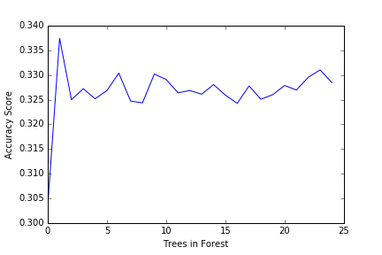

# Subject

This report examines the ability of personal characteristics to predict alcoholic drink preference. Our target variable is to predict
responses to the following question.

* MAIN TYPE OF ALCOHOL CONSUMED DURING PERIOD OF HEAVIEST DRINKING
  * 1\.  Coolers
  * 2\.  Beer
  * 3\.  Wine
  * 4\.  Liquor
  * 9\.  Unknown
  * BL.  NA, lifetime abstainer
  
Explanatory variables include gender, age, ethnicity, income, student status, retired status, current drinking status, and
urban density of residence.

Data is from the National Epidemiologic Survey of Drug Use and Health Survey.

# Method

A random forest is run using sklearn's RandomForestClassifier. 60% of the data is used for training while 40% is withheld for
evaluating accuracy. As a learning exercise, the script reruns the analysis with different numbers of trees similar to the video
example.

The confusion matrix and accuracy score are used to evaluate effectiveness.

# Results

The correct drink is predicted 50% of the time. Interestingly the three predictors with high feature importance are age (0.324),
income (0.147), and current drink status (0.437). The importance of all other predictors is less than 0.01

The chart below shows how increasing the number of trees beyond 5 gains little in accuracy.


# Raw Output
```
CONSUMER     int64
S1Q10B       int64
S1Q1C        int64
S1Q1D5       int64
S1Q1D3       int64
S1Q1D2       int64
S1Q1D1       int64
SEX          int64
DOBY         int64
S1Q7A9       int64
S1Q7A10      int64
S2AQ23      object
dtype: object
           CONSUMER        S1Q10B         S1Q1C        S1Q1D5        S1Q1D3  \
count  43093.000000  43093.000000  43093.000000  43093.000000  43093.000000   
mean       1.566519      6.757501      1.807208      1.239111      1.800432   
std        0.793237      4.406653      0.394496      0.426545      0.399681   
min        1.000000      0.000000      1.000000      1.000000      1.000000   
25%        1.000000      3.000000      2.000000      1.000000      2.000000   
50%        1.000000      7.000000      2.000000      1.000000      2.000000   
75%        2.000000     10.000000      2.000000      1.000000      2.000000   
max        3.000000     17.000000      2.000000      2.000000      2.000000   

             S1Q1D2        S1Q1D1           SEX          DOBY        S1Q7A9  \
count  43093.000000  43093.000000  43093.000000  43093.000000  43093.000000   
mean       1.969044      1.969740      1.570278   1954.414824      1.805096   
std        0.173201      0.171304      0.495042     18.184347      0.396131   
min        1.000000      1.000000      1.000000   1895.000000      1.000000   
25%        2.000000      2.000000      1.000000   1942.000000      2.000000   
50%        2.000000      2.000000      2.000000   1957.000000      2.000000   
75%        2.000000      2.000000      2.000000   1969.000000      2.000000   
max        2.000000      2.000000      2.000000   1984.000000      2.000000   

            S1Q7A10  
count  43093.000000  
mean       1.957905  
std        0.200808  
min        1.000000  
25%        2.000000  
50%        2.000000  
75%        2.000000  
max        2.000000  
training and test shapes:
(25855, 11)
(17238, 11)
(25855,)
(17238,)
Confusion matrix:
[[3266    0    0    0    0    0]
 [   0   96  222   57  123  245]
 [   0  124 2544  265  608 1437]
 [   0   64  406  232  307  477]
 [   0   99  893  265  538  707]
 [   0  102 1392  299  449 2021]]
Accuracy score:
0.504524886878
Feature importance:
[ 0.43725157  0.14760317  0.00751252  0.00686116  0.00534139  0.00387797
  0.0062187   0.04687517  0.32376475  0.0087564   0.00593721]
```

# Program
```
import pandas as pd
import numpy as np
import matplotlib.pylab as plt
from sklearn.cross_validation import train_test_split
from sklearn.ensemble import RandomForestClassifier
import sklearn.metrics
from sklearn.ensemble import ExtraTreesClassifier

# HISPANIC OR LATINO ORIGIN
# 1. Yes
# 2.  No
HISPANIC = 'S1Q1C'

# "BLACK OR AFRICAN AMERICAN" CHECKED IN MULTIRACE CODE
# 1. Yes
# 2.  No
BLACK = 'S1Q1D3'

# "AMERICAN INDIAN OR ALASKA NATIVE" CHECKED IN MULTIRACE CODE
# 1. Yes
# 2.  No
AM_INDIAN = 'S1Q1D1'

# "WHITE" CHECKED IN MULTIRACE CODE
# 1. Yes
# 2.  No
WHITE = 'S1Q1D5'

# "ASIAN" CHECKED IN MULTIRACE CODE
# 1. Yes
# 2.  No
ASIAN = 'S1Q1D2'

# SEX
# 1. Male
# 2. Femail
GENDER = 'SEX'

# DATE OF BIRTH: YEAR
# 1895-1984.  Year
BIRTH_YEAR = 'DOBY'

# MSA TYPE
# 1.  In MSA - in central city
# 2.  In MSA - not in central city
# 3.  Not in MSA
URBAN_DENSITY = 'CCS'

# PRESENT SITUATION INCLUDES RETIRED
# 1. Yes
# 2.  No
RETIRED = 'S1Q7A9'

# PRESENT SITUATION INCLUDES IN SCHOOL FULL TIME
# 1. Yes
# 2.  No
STUDENT = 'S1Q7A10'

# TOTAL PERSONAL INCOME IN LAST 12 MONTHS: CATEGORY
#  0.  $0 (No personal income)
#  1.  $1 to $4,999
#  2.  $5,000 to $7,999
#  3.  $8,000 to $9,999
#  4.  $10,000 to $12,999
#  5.  $13,000 to $14,999
#  6.  $15,000 to $19,999
#  7.  $20,000 to $24,999
#  8.  $25,000 to $29,999
#  9.  $30,000 to $34,999
# 10.  $35,000 to $39,999
# 11.  $40,000 to $49,999
# 12.  $50,000 to $59,999
# 13.  $60,000 to $69,999
# 14.  $70,000 to $79,999
# 15.  $80,000 to $89,999
# 16.  $90,000 to $99,999
# 17.  $100,000 or more
INCOME = 'S1Q10B'

# DRINKING STATUS
#  1.  Current drinker
#  2.  Ex-drinker
#  3.  Lifetime Abstainer
DRINK_STATUS = 'CONSUMER'

# MAIN TYPE OF ALCOHOL CONSUMED DURING PERIOD OF HEAVIEST DRINKING
# 1.  Coolers
# 2.  Beer
# 3.  Wine
# 4.  Liquor
# 9.  Unknown
# BL.  NA, lifetime abstainer
DRINK_PREF = 'S2AQ23'

predictor_columns = [DRINK_STATUS, INCOME, HISPANIC, WHITE, BLACK, ASIAN, AM_INDIAN, GENDER, BIRTH_YEAR, RETIRED, STUDENT]
target_column = DRINK_PREF

nesarc = pd.read_csv("../data/nesarc.csv")
nesarc = nesarc[predictor_columns + [target_column]].dropna()
nesarc[DRINK_PREF].describe()

print(nesarc.dtypes)
print(nesarc.describe())

# Try to predict a person's type of drink
predictors = nesarc[predictor_columns]
targets = nesarc[target_column]
pred_train, pred_test, tar_train, tar_test  = train_test_split(predictors, targets, test_size=.4)

print('training and test shapes:')
print(pred_train.shape)
print(pred_test.shape)
print(tar_train.shape)
print(tar_test.shape)

# Learn!
classifier=RandomForestClassifier(n_estimators=25)
classifier=classifier.fit(pred_train,tar_train)
predictions=classifier.predict(pred_test)

# Evaluate learning
print('Confusion matrix:')
print(sklearn.metrics.confusion_matrix(tar_test,predictions))
print('Accuracy score:')
print(sklearn.metrics.accuracy_score(tar_test, predictions))

model = ExtraTreesClassifier()
model.fit(pred_train,tar_train)
print('Feature importance:')
print(model.feature_importances_)


"""
Running a different number of trees and see the effect
 of that on the accuracy of the prediction
"""

trees=range(25)
accuracy=np.zeros(25)

for idx in range(len(trees)):
    classifier=RandomForestClassifier(n_estimators=idx + 1)
    classifier=classifier.fit(pred_train,tar_train)
    predictions=classifier.predict(pred_test)
    accuracy[idx]=sklearn.metrics.accuracy_score(tar_test, predictions)

fig = plt.figure()
plt.cla()
plt.xlabel('Trees in Forest')
plt.ylabel('Accuracy Score')
plt.plot(trees, accuracy)
fig.savefig('accuracy-trees.png')
```
