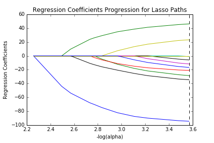
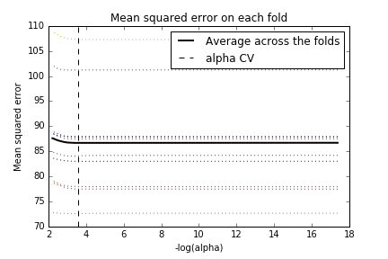

# Results
Who's the biggest drinker? The goal is to predict a person's usual number of drinks with demographic data. For this exercise, lasso regression is used to find a subset of interesting explanatory variables. The R^2 is so low at 0.012 that it will likely require more explanatory variables to make interesting predictions. 

Variable           | Coefficient
--- | ---:
DRINK_PREF_wine    | -0.859
SEX                | -0.686
DRINK_PREF_coolers | -0.425
Birth Year (DOBY)  |  0.356
DRINK_PREF_liquor  | -0.350
Income (S1Q10A)    | -0.179
Asian (S1Q1D2)     |  0.167
Hispanic (S1Q1C)   | -0.150
White (S1Q1D5)     | -0.007
Am Indian (S1Q1D1) | -0.044
Student (S1Q7A10)  |  0.0
Retired (S1Q7A9)   |  0.0
DRINK_PREF_beer    |  0.0
Black (S1Q1D3)     |  0.0

What can we tell? Women drink less than men. Given differences in average body weight that's a good sign that the data is not messed up! The only positive predictors are age (older drinkers drink more, beta 0.356) and Asian (beta 0.157). Drinkers of wine and wine coolers drink less. Surprisingly, drinkers of liquor also drink less. That merits further exploration.

Thankfully ethnicity is not terribly useful. That would have made this report awkward. I expected Students and the Retired to have behavior outside the usual, but that does not appear to be the case.




# Data
* **response question** NUMBER OF DRINKS OF ANY ALCOHOL USUALLY CONSUMED ON DAYS WHEN DRANK ALCOHOL IN LAST 12 MONTHS
* **explanatory questions**
  * MAIN TYPE OF ALCOHOL CONSUMED DURING PERIOD OF HEAVIEST DRINKING (made into dummies for coolers, beer, wine, and liquor)
  * TOTAL PERSONAL INCOME IN LAST 12 MONTHS (quantitative)
  * PRESENT SITUATION INCLUDES IN SCHOOL FULL TIME (binary)
  * PRESENT SITUATION INCLUDES RETIRED (binary)
  * DATE OF BIRTH: YEAR (quantitative)
  * SEX (binary)
  * "ASIAN" CHECKED IN MULTIRACE CODE
  * "WHITE" CHECKED IN MULTIRACE CODE
  * "AMERICAN INDIAN OR ALASKA NATIVE" CHECKED IN MULTIRACE CODE
  * "BLACK OR AFRICAN AMERICAN" CHECKED IN MULTIRACE CODE
  * HISPANIC OR LATINO ORIGIN
* I've excluded lifetime abstainers from the regression
* Data is randomly split into 70% training and 30% test sets.
* All predictors are normalized to mean 0 and standard deviation 1.

# Output
```
predictor_columns ['CONSUMER', 'S1Q10A', 'S1Q1C', 'S1Q1D5', 'S1Q1D3', 'S1Q1D2', 'S1Q1D1', 'SEX', 'DOBY', 'S1Q7A9', 'S1Q7A10', 'DRINK_PREF_coolers', 'DRINK_PREF_beer', 'DRINK_PREF_wine', 'DRINK_PREF_liquor']
Data read!
(26946, 16)
CONSUMER              float64
S1Q10A                float64
S1Q1C                 float64
S1Q1D5                float64
S1Q1D3                float64
S1Q1D2                float64
S1Q1D1                float64
SEX                   float64
DOBY                  float64
S1Q7A9                float64
S1Q7A10               float64
DRINK_PREF_coolers    float64
DRINK_PREF_beer       float64
DRINK_PREF_wine       float64
DRINK_PREF_liquor     float64
S2AQ8B                float64
dtype: object
   CONSUMER    S1Q10A     S1Q1C    S1Q1D5    S1Q1D3    S1Q1D2   S1Q1D1  \
1 -0.540809 -0.435886 -2.165585 -0.526064  0.476666  0.156442  0.17588   
5 -0.540809 -0.672720  0.461769  1.900910 -2.097906  0.156442  0.17588   
6 -0.540809 -0.627609  0.461769  1.900910 -2.097906  0.156442  0.17588   
7 -0.540809 -0.142663  0.461769 -0.526064  0.476666  0.156442  0.17588   
8 -0.540809  0.782117  0.461769 -0.526064  0.476666  0.156442  0.17588   

        SEX      DOBY    S1Q7A9   S1Q7A10  DRINK_PREF_coolers  \
1  0.936570  1.025910  0.464330  0.202587                 0.0   
5  0.936570  0.622814  0.464330  0.202587                 1.0   
6 -1.067726  1.544177  0.464330 -4.936155                 0.0   
7  0.936570 -2.256446 -2.153642  0.202587                 0.0   
8  0.936570  0.968325  0.464330  0.202587                 0.0   

   DRINK_PREF_beer  DRINK_PREF_wine  DRINK_PREF_liquor  S2AQ8B  
1              1.0              0.0                0.0     1.0  
5              0.0              0.0                0.0     1.0  
6              0.0              0.0                1.0     1.0  
7              0.0              1.0                0.0     1.0  
8              0.0              0.0                0.0     1.0  
           CONSUMER        S1Q10A         S1Q1C        S1Q1D5        S1Q1D3  \
count  2.694600e+04  26946.000000  26946.000000  26946.000000  26946.000000   
mean  -5.408085e-01      0.055554     -0.020780     -0.053837      0.056170   
std    1.986226e-13      1.088510      1.017356      0.960790      0.951743   
min   -5.408085e-01     -0.683998     -2.165585     -0.526064     -2.097906   
25%   -5.408085e-01     -0.424608      0.461769     -0.526064      0.476666   
50%   -5.408085e-01     -0.131385      0.461769     -0.526064      0.476666   
75%   -5.408085e-01      0.240782      0.461769     -0.526064      0.476666   
max   -5.408085e-01     66.982848      0.461769      1.900910      0.476666   

             S1Q1D2        S1Q1D1           SEX          DOBY        S1Q7A9  \
count  26946.000000  26946.000000  26946.000000  26946.000000  26946.000000   
mean      -0.005170      0.007728     -0.035379      0.135325      0.099217   
std        1.015997      0.978465      1.001711      0.946637      0.906961   
min       -6.392134     -5.685708     -1.067726     -3.120224     -2.153642   
25%        0.156442      0.175880     -1.067726     -0.471305      0.464330   
50%        0.156442      0.175880      0.936570      0.277302      0.464330   
75%        0.156442      0.175880      0.936570      0.853154      0.464330   
max        0.156442      0.175880      0.936570      1.659347      0.464330   

            S1Q7A10  DRINK_PREF_coolers  DRINK_PREF_beer  DRINK_PREF_wine  \
count  26946.000000        26946.000000     26946.000000     26946.000000   
mean      -0.035604            0.043346         0.331329         0.093743   
std        1.080421            0.203638         0.470700         0.291476   
min       -4.936155            0.000000         0.000000         0.000000   
25%        0.202587            0.000000         0.000000         0.000000   
50%        0.202587            0.000000         0.000000         0.000000   
75%        0.202587            0.000000         1.000000         0.000000   
max        0.202587            1.000000         1.000000         1.000000   

       DRINK_PREF_liquor        S2AQ8B  
count       26946.000000  26946.000000  
mean            0.140800      3.352965  
std             0.347822      9.335216  
min             0.000000      1.000000  
25%             0.000000      1.000000  
50%             0.000000      2.000000  
75%             0.000000      3.000000  
max             1.000000     99.000000  
training and test shapes:
(18862, 15)
(8084, 15)
(18862,)
(8084,)
{'S1Q1C': -0.15022904966549055, 'DRINK_PREF_liquor': -0.34959907162259052, 'S1Q10A': -0.17912236534262907, 'DRINK_PREF_wine': -0.8591272205674878, 'CONSUMER': 0.0, 'S1Q1D2': 0.16747397555954033, 'DRINK_PREF_coolers': -0.42507908987281268, 'SEX': -0.68614805322549421, 'DRINK_PREF_beer': 0.0, 'S1Q1D3': 0.0, 'S1Q1D1': -0.044241394645813115, 'S1Q7A9': 0.0, 'S1Q1D5': -0.0073359383637455425, 'S1Q7A10': 0.0, 'DOBY': 0.35595281226560954}
training data MSE
86.5922758304
test data MSE
84.6901904283
training data R-square
0.0115443621335
test data R-square
0.0159756025229
```

# Program
The python code is available [here](week3.py).
