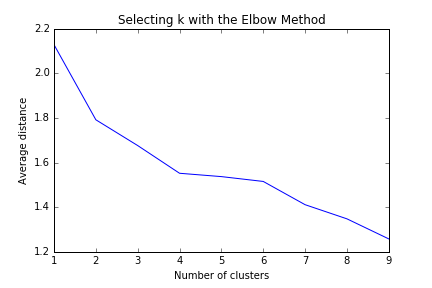
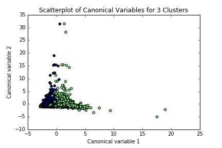

# Subject
This report will attempt to group respondents of the National Epidemiologic Survey of Drug Use and Health survey by factors that could influence drinking behavior. Then we will see if these groups have different drink preferences: beer, wine, or liquor.

Explanatory variables
* Gender
* Birth Year
* Household Income
* "HOW MANY DRINKS CAN HOLD WITHOUT FEELING INTOXICATED"
* "NUMBER OF EPISODES OF ALCOHOL DEPENDENCE"
* "NUMBER OF EPISODES" of Social Fear

Only survey respondents that drink are included in the analysis. K-Means clustering is used to find groups within the data.

Based on the figure below, a model with three clusters is used because there is little gain from adding a fourth cluster.



# Results



Chi Squared tests are run across the 2x2 combinations of three drink preference values (beer, wine, liquor) and three clusters. The Bonferroni adjusted p-value is 0.0056 and 6 of the 9 comparisons reject the null hypothesis and suggest a difference in drink preference between clusters.

* Liquor/Beer in Clusters 0 and 1 p-value of 8.4873329742946444e-135
* Liquor/Beer in Clusters 0 and 2 p-value of 0.016754828722719578
* Liquor/Beer in Clusters 1 and 2 p-value of 5.8943305165207128e-08
* Liquor/Wine in Clusters 0 and 1 p-value of 9.3518531019675893e-32
* Liquor/Wine in Clusters 0 and 2 p-value of 0.13685700430412592
* Liquor/Wine in Clusters 1 and 2 p-value of 0.0117522249997958
* Beer/Wine in Clusters 0 and 1 p-value of 3.45374015081728e-248
* Beer/Wine in Clusters 0 and 2 p-value of 0.00014766515643412973
* Beer/Wine in Clusters 1 and 2 p-value of 1.5159270945103454e-14

# Program
```
import itertools
import pandas as pd
from pandas import DataFrame
import numpy as np
from sklearn import preprocessing
from sklearn.cross_validation import train_test_split
from sklearn.cluster import KMeans
from scipy.spatial.distance import cdist
import matplotlib.pylab as plt
from scipy.stats import chi2_contingency

# SEX
# 1. Male
# 2. Femail
GENDER = 'SEX'

# DATE OF BIRTH: YEAR
# 1895-1984.  Year
BIRTH_YEAR = 'DOBY'

# HOW MANY DRINKS CAN HOLD WITHOUT FEELING INTOXICATED
# 0-98.  Number of drinks
# 99. Unknown
# BL.  NA, former drinker or lifetime abstainer
DRINKS_HOLD = 'S2AQ11'

# NUMBER OF EPISODES OF ALCOHOL DEPENDENCE
# 1-98.  Number of episodes
# 99.  Unknown
# BL.  NA, lifetime abstainer; did not meet symptom and/or duration criteria for lifetime alcohol dependence
AL_DEP_NUM = 'S2BQ2E'

# NUMBER OF EPISODES
# 1-98.  Separate times
# 99. Unknown
# BL.  NA, never or unknown if ever had fear/avoidance of social situation
SOCIAL_FEAR_DUR = 'S7Q17C'

# DURATION (WEEKS) OF ONLY/LONGEST EPISODE (BASED ON S7Q20A IF ONLY 1 EPISODE)
# 1-4435.  Weeks
# 9999.  Unknown
# BL.  NA, never or unknown if ever had fear/avoidance of social situation
SOCIAL_FEAR_LONG = 'S7Q19DR'

# TOTAL HOUSEHOLD INCOME IN LAST 12 MONTHS
# 24-3000000.  Household income in dollars
HOUSEHOLD_INCOME = 'S1Q12A'

# DRINKING STATUS
# 1.  Current drinker
# 2.  Ex-drinker
# 3.  Lifetime Abstainer
DRINK_STATUS = 'CONSUMER'

# MAIN TYPE OF ALCOHOL CONSUMED DURING PERIOD OF HEAVIEST DRINKING
# 1.  Coolers
# 2.  Beer
# 3.  Wine
# 4.  Liquor
# 9.  Unknown
# BL.  NA, lifetime abstainer
DRINK_PREF = 'S2AQ23'

explanatory_cols = [BIRTH_YEAR, DRINKS_HOLD, AL_DEP_NUM, SOCIAL_FEAR_DUR, GENDER, HOUSEHOLD_INCOME]
cols = [DRINK_STATUS, DRINK_PREF] + explanatory_cols

nesarc = pd.read_csv('../data/nesarc.csv', low_memory=False)[cols]
# Forget the non-drinkers.
nesarc = nesarc[ nesarc[DRINK_STATUS] != 3 ]

def prepare_numeric(data, attr, map_before={}, map_after={}):
    for oldVal, newVal in map_before.items():
      data[attr] = data[attr].replace(oldVal, newVal)
    data[attr] = pd.to_numeric(data[attr], errors='coerce')
    for oldVal, newVal in map_after.items():
      data[attr] = data[attr].replace(oldVal, newVal)

# Scale everything to mean 0, stdev 1
def to_normal_scale(data, *attrs):
    for attr in attrs:
        data[attr] = preprocessing.scale(data[attr].astype('float64'))
        print('Scaled %s to %s and std %s' % (attr, data[attr].mean(), data[attr].std()))

def summarize(data, attr, desc):
    counts = data.groupby(attr, sort=True).size()
    relative = counts * 100 / len(data)
    print('-' * 80)
    print(desc)
    print('Response counts:')
    print(counts)
    print('Response percentages:')
    print(relative)

# No change needed for BIRTH_YEAR, GENDER, and HOUSEHOLD_INCOME.
# Set unknown values to 1 and NA to 0.
prepare_numeric(nesarc, DRINKS_HOLD, map_after={99: 1})
prepare_numeric(nesarc, AL_DEP_NUM, map_before={' ': 0}, map_after={99: 1})
prepare_numeric(nesarc, SOCIAL_FEAR_DUR, map_before={' ': 0}, map_after={9999: 1})
prepare_numeric(nesarc, DRINK_PREF, map_after={9: np.nan, 1: np.nan}) # Ignore coolers (1).

# summarize(nesarc, DRINKS_HOLD, 'DRINKS_HOLD')
# summarize(nesarc, AL_DEP_NUM, 'AL_DEP_NUM')
# summarize(nesarc, SOCIAL_FEAR_DUR, 'Social Fear Duration')
# summarize(nesarc, HOUSEHOLD_INCOME, 'Household Income')
# summarize(nesarc, GENDER, 'Gender')
# summarize(nesarc, DRINK_STATUS, 'Drink status')
# summarize(nesarc, DRINK_PREF, 'Drink preference')

nesarc = nesarc[cols].dropna()
to_normal_scale(nesarc, *explanatory_cols)

# split data into train and test sets
clus_train, clus_test = train_test_split(nesarc, test_size=.3, random_state=830)

# k-means cluster analysis for 1-9 clusters
clusters=range(1,10)
meandist=[]

for k in clusters:
    model=KMeans(n_clusters=k)
    model.fit(clus_train)
    clusassign=model.predict(clus_train)
    meandist.append(sum(np.min(cdist(clus_train, model.cluster_centers_, 'euclidean'), axis=1)) 
    / clus_train.shape[0])

"""
Plot average distance from observations from the cluster centroid
to use the Elbow Method to identify number of clusters to choose
"""

fig = plt.figure()
plt.plot(clusters, meandist)
plt.xlabel('Number of clusters')
plt.ylabel('Average distance')
plt.title('Selecting k with the Elbow Method')
fig.savefig('clusters_distance.png')
plt.show()

# Interpret 3 cluster solution
model3=KMeans(n_clusters=3)
model3.fit(clus_train)
clusassign=model3.predict(clus_train)

# plot clusters
from sklearn.decomposition import PCA
pca_2 = PCA(2)
plot_columns = pca_2.fit_transform(clus_train)
fig = plt.figure()
plt.scatter(x=plot_columns[:,0], y=plot_columns[:,1], c=model3.labels_,)
plt.xlabel('Canonical variable 1')
plt.ylabel('Canonical variable 2')
plt.title('Scatterplot of Canonical Variables for 3 Clusters')
fig.savefig('pca_scatter.png')
plt.show()

# Label data by their assigned cluster.
clus_train.reset_index(inplace=True)
cluster_assignments = pd.DataFrame(data=model3.labels_, columns=['cluster'])
clustered = pd.concat([clus_train, cluster_assignments], axis=1)

# FINALLY calculate clustering variable means by cluster
print("Clustering variable means by cluster")
print(clustered.groupby('cluster').mean())

# Analyize differences in drink preference by cluster
crosstab = pd.crosstab(clustered[DRINK_PREF], clustered['cluster'])
relative_crosstab = crosstab.apply(lambda r: 100*r/r.sum(), axis=1)
print(relative_crosstab)
print(chi2_contingency(crosstab))

# Test each pair of drink preference and cluster.
# DRINK_PREF is 2, 3, 4
# cluster is 0, 1, 2
drink_prefs = clustered[DRINK_PREF].unique()
clusters = clustered['cluster'].unique()
for (drink_pref_a, drink_pref_b) in itertools.combinations(drink_prefs, 2):
    for (cluster_a, cluster_b) in itertools.combinations(clusters, 2):
        print('\n\n{} and {}, {} and {}'.format(drink_pref_a, drink_pref_b, cluster_a, cluster_b))
        testable = pd.DataFrame()
        dp_series = clustered[DRINK_PREF].map({drink_pref_a: drink_pref_a, drink_pref_b: drink_pref_b})
        c_series = clustered['cluster'].map({cluster_a: cluster_a, cluster_b: cluster_b})
        testable = pd.concat([dp_series, c_series], axis=1).dropna()
        print(testable.shape)
        testable_crosstab = pd.crosstab(testable[DRINK_PREF], testable['cluster'])
        print(chi2_contingency(testable_crosstab))
```

# Program Output
```
Scaled DOBY to 3.814032568843765e-15 and std 1.000032792798725
Scaled S2AQ11 to 8.341089274331629e-16 and std 1.0000327927986685
Scaled S2BQ2E to -8.801036732788943e-17 and std 1.0000327927986612
Scaled S7Q17C to 1.9081038996127494e-15 and std 1.000032792798664
Scaled SEX to 1.3640423756117316e-16 and std 1.0000327927987687
Scaled S1Q12A to 1.2109207189494345e-16 and std 1.0000327927987025




Clustering variable means by cluster
                index  CONSUMER    S2AQ23      DOBY    S2AQ11    S2BQ2E  \
cluster                                                                   
0        22003.020304       1.0  2.921247 -0.023911 -0.258013 -0.049397   
1        21800.271629       1.0  2.439077  0.044765  0.226267  0.030047   
2        20538.489960       1.0  2.767068 -0.205294 -0.110169  0.085147   

           S7Q17C       SEX    S1Q12A  
cluster                                
0       -0.153843  1.058224 -0.033210  
1       -0.153732 -0.942813  0.045752  
2        6.345026  0.012375 -0.048986  
cluster          0          1         2
S2AQ23                                 
2.0      31.538462  66.362179  2.099359
3.0      75.787064  21.637092  2.575844
4.0      58.972450  38.309754  2.717796
(1381.5499254151914, 6.9216605793755352e-298, 4, array([[ 2850.76735688,  3243.65408039,   145.57856273],
       [  798.12348918,   908.11917924,    40.75733158],
       [ 1227.10915394,  1396.22674037,    62.66410569]]))


4.0 and 2.0, 0 and 1
(8722, 2)
(610.55161751575054, 8.4873329742946444e-135, 1, array([[ 2487.86608576,  3621.13391424],
       [ 1064.13391424,  1548.86608576]]))


4.0 and 2.0, 0 and 2
(3756, 2)
(5.7218750116889883, 0.016754828722719578, 1, array([[ 1984.99680511,   114.00319489],
       [ 1567.00319489,    89.99680511]]))


4.0 and 2.0, 1 and 2
(5374, 2)
(29.397839934888861, 5.8943305165207128e-08, 1, array([[ 4109.83252698,   162.16747302],
       [ 1060.16747302,    41.83252698]]))


4.0 and 3.0, 0 and 1
(4315, 2)
(137.50476610394441, 9.3518531019675893e-32, 1, array([[ 1147.02572422,   554.97427578],
       [ 1760.97427578,   852.02572422]]))


4.0 and 3.0, 0 and 2
(3026, 2)
(2.212947098194106, 0.13685700430412592, 1, array([[ 1315.61533377,    53.38466623],
       [ 1592.38466623,    64.61533377]]))


4.0 and 3.0, 1 and 2
(1525, 2)
(6.3478710478359863, 0.0117522249997958, 1, array([[  390.2695082,    32.7304918],
       [ 1016.7304918,    85.2695082]]))


2.0 and 3.0, 0 and 1
(7811, 2)
(1132.118099631165, 3.45374015081728e-248, 1, array([[ 2574.68032262,  3534.31967738],
       [  717.31967738,   984.68032262]]))


2.0 and 3.0, 0 and 2
(3468, 2)
(14.401748246191787, 0.00014766515643412973, 1, array([[ 1992.47635525,   106.52364475],
       [ 1299.52364475,    69.47635525]]))


2.0 and 3.0, 1 and 2
(4695, 2)
(59.077369222904366, 1.5159270945103454e-14, 1, array([[ 4111.85686901,   160.14313099],
       [  407.14313099,    15.85686901]]))
```
