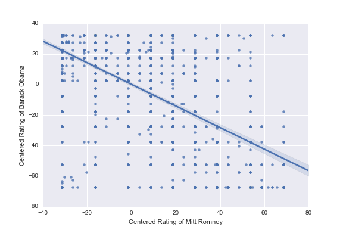
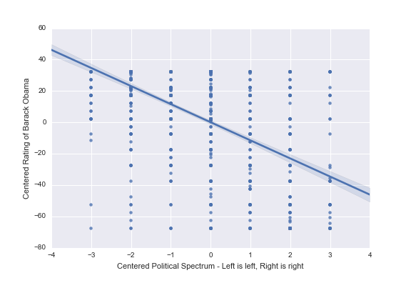
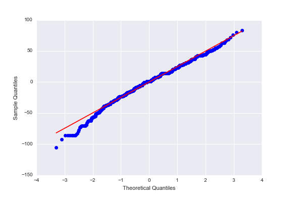
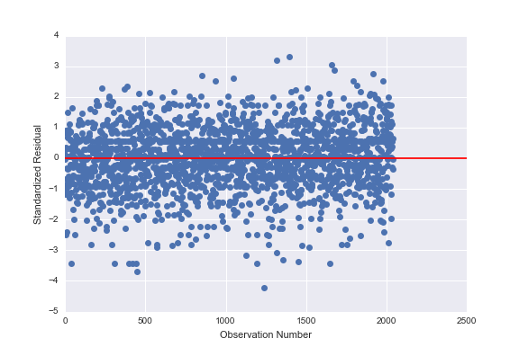
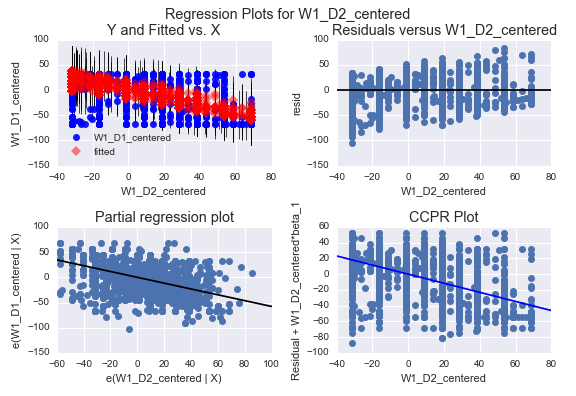
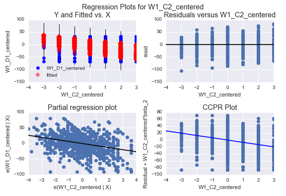
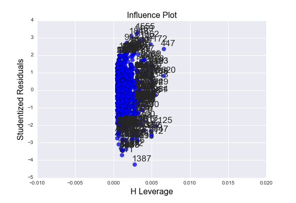
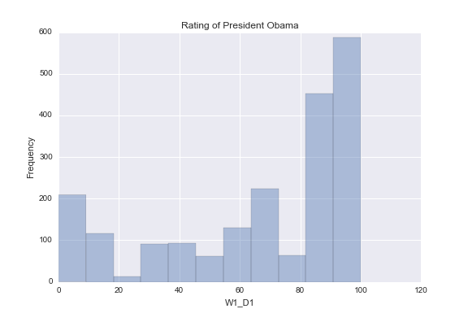
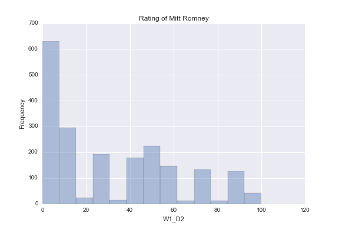
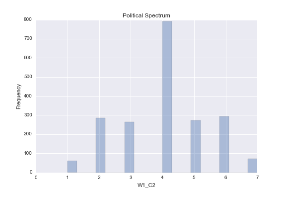

# Subject
How much does a rating of one candidate affect the rating of their opponent? My hypothesis is that rating one candidate highly will
be associated with rating the other candidate poorly. I will examine the relationship between ratings
of Mitt Romney and Barack Obama using data from the Outlook on Life Survey, 2012. Political opinions are also driven by where
a person is on the political spectrum. I've included a measure of political leaning in the analysis in case it confounds the association.

# Data
* Response variable `RATE_BARACK = 'W1_D1'`
  * "How would you rate [Barack Obama]"
  * Ratings are 0 to 100 inclusive.
* Explanatory variable `RATE_ROMNEY = 'W1_D2'`
  * "How would you rate [Mitt Romney]"
  * Ratings are 0 to 100 inclusive.
* Explanatory variable (and possible confounder) `POLITICAL_SPECTRUM = 'W1_C2'`
  * "We hear a lot of talk these days about liberals and conservatives. Where would you place YOURSELF on this 7 point scale?"
    * 1  Extremely liberal
    * 2  Liberal
    * 3  Slightly liberal
    * 4  Moderate; middle of the road
    * 5  Slightly conservative
    * 6  Conservative
    * 7  Extremely conservative
    * -1 Refused
  * For this analysis, treated at a quantitative variable.

All variables are centered around their mean.

# Regression Results
Both political spectrum (Beta -6.6000, p-value < 0.001) and Romney rating (Beta -0.5771, p-value 0.001) are significantly
negatively related to ratings of President Obama. Because both explanatory variables are significant, there does not
appear to be a confounding effect. The results appear to support my hypothesis. Together, according to the r squared, the
explanatory variables account for 44% of the variation of the response. That's a solid amount, but there are clearly additional
factors out there.

```
Regression formula is W1_D1_centered ~ W1_D2_centered + W1_C2_centered.
                            OLS Regression Results                            
==============================================================================
Dep. Variable:         W1_D1_centered   R-squared:                       0.445
Model:                            OLS   Adj. R-squared:                  0.444
Method:                 Least Squares   F-statistic:                     815.3
Date:                Thu, 13 Oct 2016   Prob (F-statistic):          8.06e-261
Time:                        23:22:33   Log-Likelihood:                -9454.0
No. Observations:                2039   AIC:                         1.891e+04
Df Residuals:                    2036   BIC:                         1.893e+04
Df Model:                           2                                         
Covariance Type:            nonrobust                                         
==================================================================================
                     coef    std err          t      P>|t|      [95.0% Conf. Int.]
----------------------------------------------------------------------------------
Intercept          0.1939      0.553      0.350      0.726        -0.891     1.279
W1_D2_centered    -0.5771      0.021    -27.702      0.000        -0.618    -0.536
W1_C2_centered    -6.6000      0.432    -15.276      0.000        -7.447    -5.753
==============================================================================
Omnibus:                       73.395   Durbin-Watson:                   2.001
Prob(Omnibus):                  0.000   Jarque-Bera (JB):               93.517
Skew:                          -0.391   Prob(JB):                     4.93e-21
Kurtosis:                       3.698   Cond. No.                         29.2
==============================================================================
```

To demonstrate visually, these are scatter plots of each explanatory variable alone plotted with the response variable. The grid pattern of the first figure suggests people are more likely to pick round numbers.




# Regression Diagnostics
The qq plot mostly follows the 45 degree line except for a bit near the origin. 


#### Standardized residuals for all observations


#### plot_regres_exog for ratings of Mitt Romney


#### plot_regres_exog for political spectrum


#### leverage plot


#### Diagnostic Results
The leverage plot suggests that some of the data is farther from the mean than expected from a normal distribution. Below
are histograms of each variable. The political spectrum looks normal, but the ratings of both Obama and Romney are heavily skewed.
The skew matches the survey's oversampling of black voters and the significantly high opinion
of the President among black Americans found in previous assignments! To compensate, we could do the analysis above separately for
black and white Americans, weight the observations in some way, or add ethnicity to the model.





# Program
```
import numpy as np
import pandas as pd
import seaborn
import matplotlib.pyplot as plt
import statsmodels.api as sm
import statsmodels.formula.api as smf

# Response variable
RATE_BARACK = 'W1_D1'
RATE_BARACK_Q = 'How would you rate [Barack Obama] [0 to 100]'

# Explanatory variable
RATE_ROMNEY = 'W1_D2'
RATE_ROMNEY_Q = 'How would you rate [Mitt Romney] [0 to 100]'

# Explanatory variable
POLITICAL_SPECTRUM = 'W1_C2'
POLITICAL_SPECTRUM_Q = """We hear a lot of talk these days about liberals and conservatives. Where would you place YOURSELF on this 7 point scale?'
1  Extremely liberal               75      3.3%
2  Liberal                         312    13.6%
3  Slightly liberal                286    12.5%
4  Moderate; middle of the road    874    38.1%
5  Slightly conservative           297    12.9%
6  Conservative                    311    13.6%
7  Extremely conservative          79      3.4%
-1 Refused                         60      2.6%
"""


def prepare_numeric(data, attr):
    data[attr] = pd.to_numeric(data[attr], errors='coerce')
    data[attr] = data[attr].replace(-1, np.nan)


def prepare_rate(data, attr):
    data[attr] = pd.to_numeric(data[attr], errors='coerce')
    data[attr] = data[attr].replace(-1, np.nan)
    data[attr] = data[attr].replace(998, np.nan)


def center(data, attr):
    mean = data[attr].mean()
    new_col = '%s_centered' % attr
    data[new_col] = (data[attr] - mean)
    # New means will be really, really close to zero, but not exactly.
    print('Centered %s into %s. Now mean is %s instead of %s' % (attr, new_col, data[new_col].mean(), mean))
    return new_col

# Read, prepare, and center data.
ool_raw = pd.read_csv('../data/ool_pds.csv')[[POLITICAL_SPECTRUM, RATE_BARACK, RATE_ROMNEY]]
prepare_numeric(ool_raw, POLITICAL_SPECTRUM)
prepare_rate(ool_raw, RATE_BARACK)
prepare_rate(ool_raw, RATE_ROMNEY)
POLITICAL_SPECTRUM_C = center(ool_raw, POLITICAL_SPECTRUM)
RATE_BARACK_C = center(ool_raw, RATE_BARACK)
RATE_ROMNEY_C = center(ool_raw, RATE_ROMNEY)
ool = ool_raw.dropna()
print('Data ready. %s' % (ool.shape,))
print(ool.head())
print('POLITICAL_SPECTRUM.describe()')
print(ool[POLITICAL_SPECTRUM].describe())
print('RATE_BARACK.describe()')
print(ool[RATE_BARACK].describe())
print('RATE_ROMNEY.describe()')
print(ool[RATE_ROMNEY].describe())

# Scatter of response with each explanatory variable.
obama_romney_scatter = seaborn.regplot(x=RATE_ROMNEY_C, y=RATE_BARACK_C, scatter=True, data=ool)
plt.xlabel('Centered Rating of Mitt Romney')
plt.ylabel('Centered Rating of Barack Obama')
obama_romney_scatter.get_figure().savefig('obama-romney-ratings-scatter.png')
plt.show()
obama_political_scatter = seaborn.regplot(x=POLITICAL_SPECTRUM_C, y=RATE_BARACK_C, scatter=True, data=ool)
plt.xlabel('Centered Political Spectrum - Left is left, Right is right')
plt.ylabel('Centered Rating of Barack Obama')
obama_political_scatter.get_figure().savefig('obama-ratings-political-spectrum-scatter.png')
plt.show()

# Regress!
formula = '%s ~ %s + %s' % (RATE_BARACK_C, RATE_ROMNEY_C, POLITICAL_SPECTRUM_C)
print('Regression formula is %s.' % formula)
regression = smf.ols(formula, data=ool).fit()
print(regression.summary())

# Q-Q plot for normality
qq_fig = sm.qqplot(regression.resid, line='r')
qq_fig.savefig('obama-rating-qq-plot.png')
plt.show()

# simple plot of residuals
stdres = pd.DataFrame(regression.resid_pearson)
stdres_fig = plt.figure()
plt.plot(stdres, 'o', ls='None')
l = plt.axhline(y=0, color='r')
plt.ylabel('Standardized Residual')
plt.xlabel('Observation Number')
plt.show()
stdres_fig.savefig('stdres-plot.png')

# additional regression diagnostic plots
plot_regres_exog_romney = plt.figure() # figsize(12,8))
plot_regres_exog_romney = sm.graphics.plot_regress_exog(regression,  RATE_ROMNEY_C, fig=plot_regres_exog_romney)
plt.show()
plot_regres_exog_romney.savefig('plot-regres-exog-romney.png')

plot_regres_exog_political = plt.figure() # figsize(12,8))
plot_regres_exog_political = sm.graphics.plot_regress_exog(regression,  POLITICAL_SPECTRUM_C, fig=plot_regres_exog_political)
plt.show()
plot_regres_exog_political.savefig('plot-regres-exog-political.png')

# leverage plot
influence_plot = sm.graphics.influence_plot(regression, size=8)
influence_plot.savefig('influence-plot.png')
print(influence_plot)
influence_plot.show()

# Examine histograms based on regression diagnostics.
fig = plt.figure()
political_hist = seaborn.distplot(ool[POLITICAL_SPECTRUM], kde=False)
plt.ylabel('Frequency')
plt.title("Political Spectrum")
plt.show()
political_hist.get_figure().savefig('political-spectrum-histogram.png')
obama_hist = seaborn.distplot(ool[RATE_BARACK], kde=False)
plt.ylabel('Frequency')
plt.title("Rating of President Obama")
obama_hist.get_figure().savefig('obama-rating-histogram.png')
plt.show()
romney_hist = seaborn.distplot(ool[RATE_ROMNEY], kde=False)
plt.ylabel('Frequency')
plt.title("Rating of Mitt Romney")
plt.show()
romney_hist.get_figure().savefig('romney-rating-histogram.png')
```
